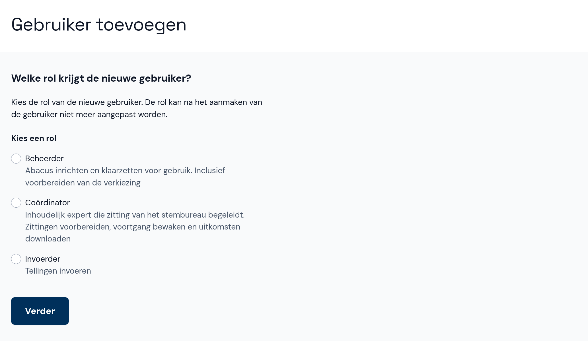
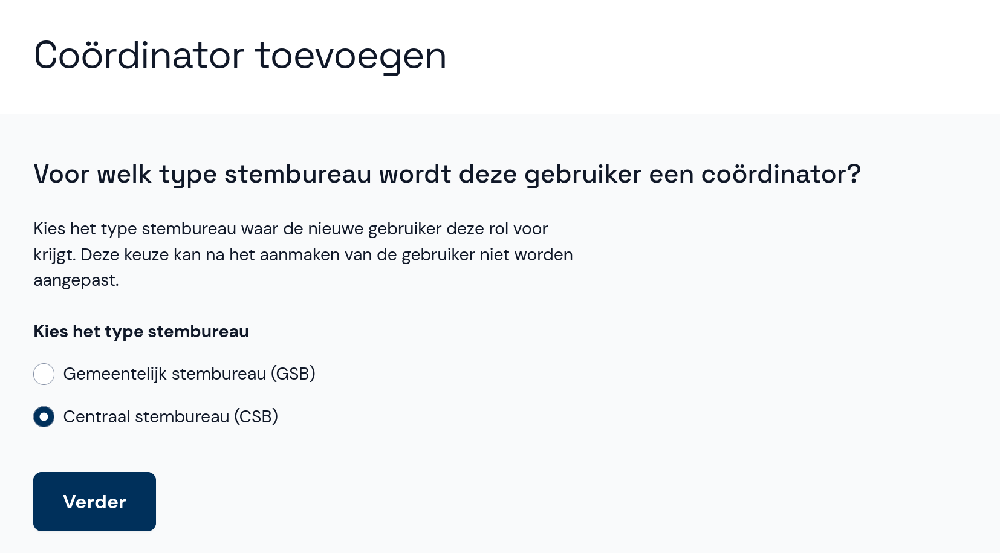
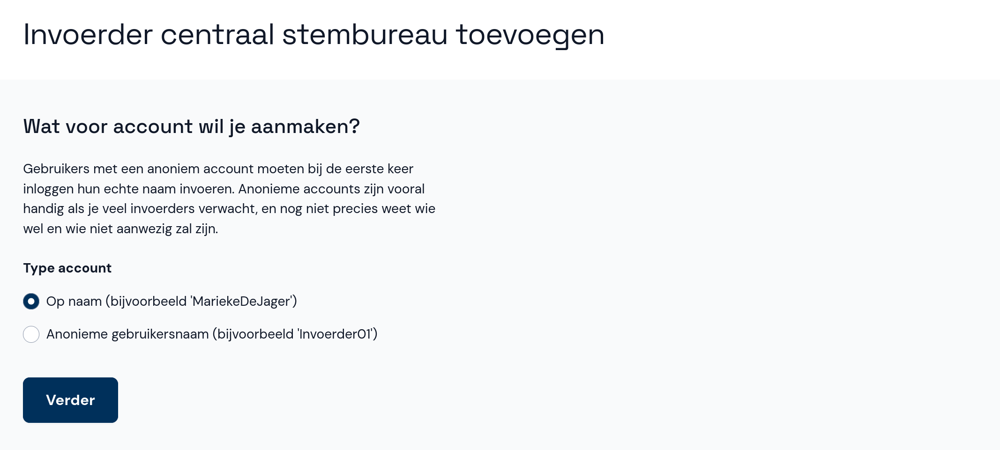
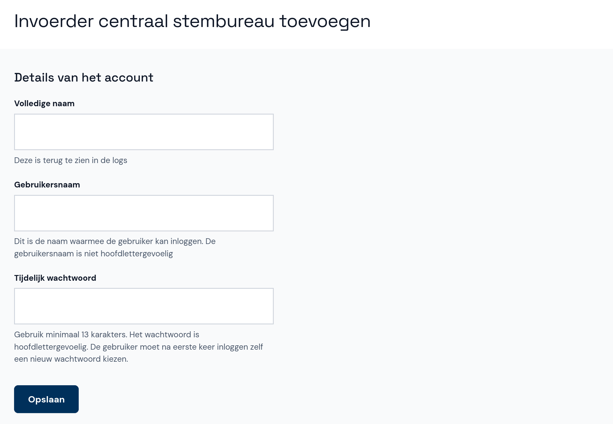

# Gebruiker toevoegen

- Selecteer onder **Gebruikers beheren** de optie **+ Gebruiker toevoegen**.
- Eerst kies je de rol van de nieuwe gebruiker: Beheerder, Coördinator of Invoerder. Dit kun je later niet meer aanpassen.

- Selecteer het type stembureau waarvoor de gebruiker een rol krijgt. In dit geval selecteer je **centraal stembureau (CSB)**.

- Als de gebruiker een invoerder is, kies je eerst of het account op naam staat of anoniem is. Voor een anoniem account moet de gebruiker bij de eerste keer inloggen de naam invoeren. Beheerders en coördinators zien dit scherm niet omdat deze accounts altijd op naam staan.

- Voer de gebruikersnaam, de volledige naam (behalve bij een anonieme invoerder) en een tijdelijk wachtwoord in. Bij de eerste keer inloggen moet de gebruiker het wachtwoord wijzigen.

