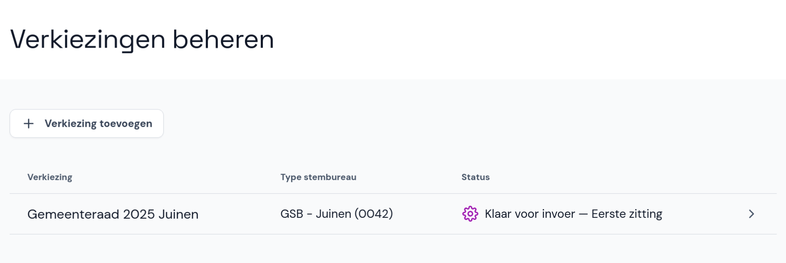

# Verkiezing toevoegen en beheren

Verzamel de gegevens die je nodig hebt om een verkiezing toe te voegen. Zorg dat je de EML-bestanden met de verkiezingsdefinitie (EML 110a) en kandidatenlijsten (EML 230b) hebt.

De EML-bestanden met de verkiezingsdefinitie en kandidatenlijsten komen uit de kandidaatstellingsmodule van OSV2020.

- In het hoofdmenu selecteer je **Verkiezingen beheren**.
- Selecteer **Verkiezing toevoegen**.

