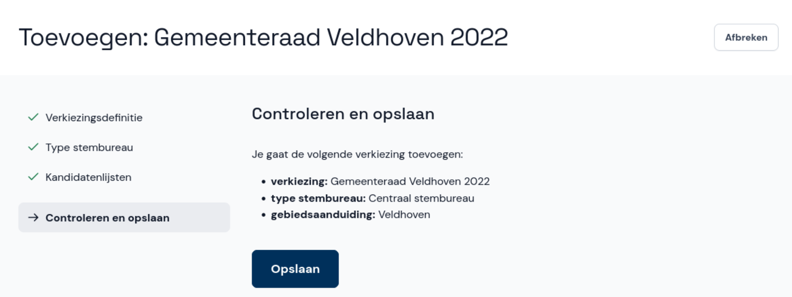
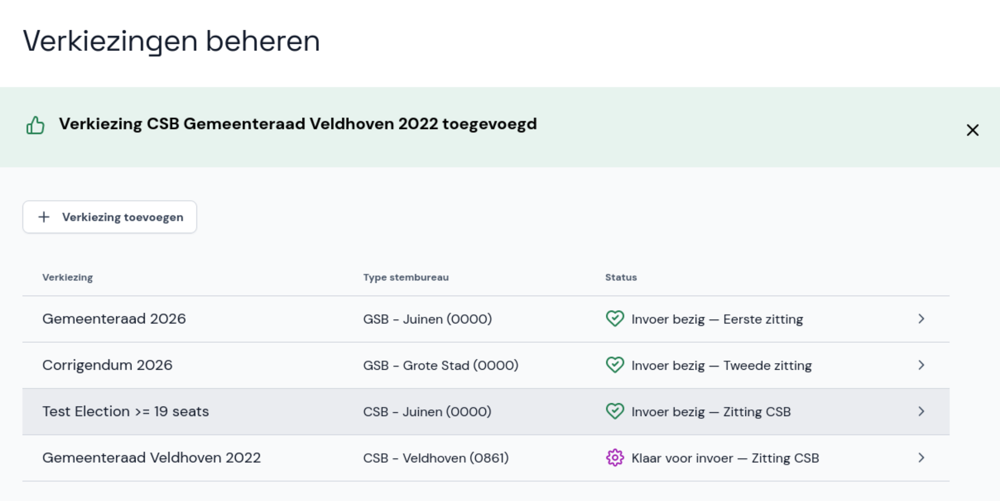

# Controleren en opslaan

- Controleer de gegevens over de verkiezing die je wil toevoegen en selecteer **Opslaan**.
- Als er iets niet klopt, selecteer je rechtsboven **Afbreken**. Daarna kun je opnieuw beginnen.

De verkiezing is nu toegevoegd en is zichtbaar in de lijst met verkiezingen.

