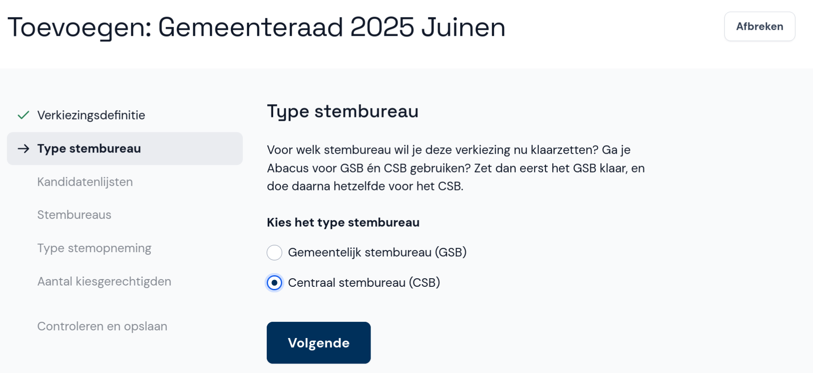

# Type stembureau

Hier geef je aan voor welk type stembureau je Abacus wilt gebruiken. Selecteer **Centraal stembureau (CSB)** en dan **Volgende**.

**Let op:** wanneer je **Volgende** selecteert, zijn de extra stappen *Stembureaus*, *Type stemopneming* en *Aantal kiesgerechtigden* niet meer zichtbaar in de navigatie. Deze stappen zijn alleen vereist bij het toevoegen van een verkiezing voor een gemeentelijk stembureau.
