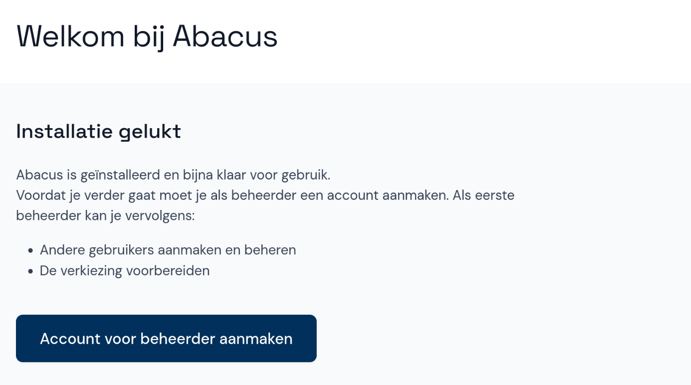

# Account voor beheerder aanmaken

Wanneer je Abacus voor de eerste keer start, is de applicatie leeg. Je begint met het aanmaken van een beheerdersaccount:

- Selecteer eerst **Account voor beheerder aanmaken** en vul je naam en een gebruikersnaam in.
- Kies een wachtwoord en selecteer **Opslaan**. Nu kun je direct inloggen met de aangemaakte gegevens.

Voordat je verdergaat met het toevoegen van een verkiezing kan het handig zijn om eerst een tweede beheerder aan te maken. Kijk hiervoor bij [Gebruiker toevoegen](./gebruikers-beheren/gebr-toevoegen.md).
