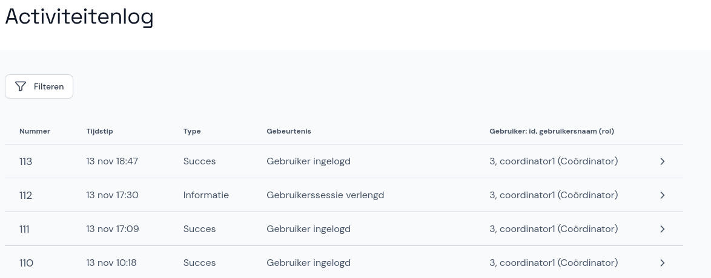
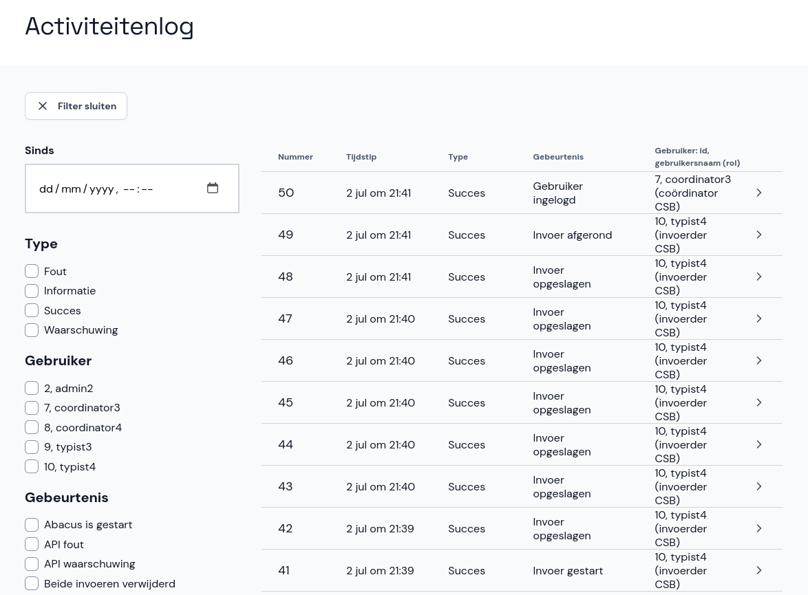

# Activiteitenlog

In het activiteitenlog kun je zien welke gebruikers zijn ingelogd en uitgelogd en welke activiteiten ze hebben uitgevoerd. Dit kan handig zijn als je wil nagaan wat er met een bepaalde invoer gebeurd is.

## Filteren

Omdat het activiteitenlog groot en moeilijk doorzoekbaar kan zijn, kun je filters gebruiken. Klik op **Filteren** om het filter te openen. Je kunt het log filteren op datum/tijd, type, gebruiker en gebeurtenis.

