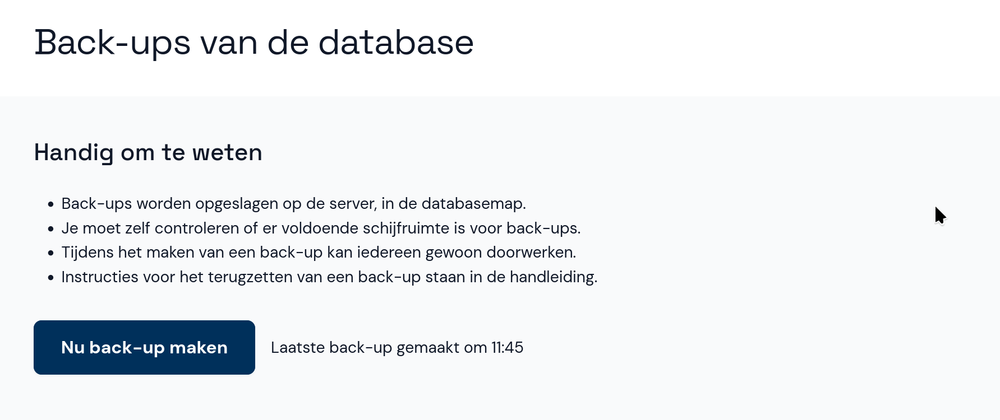

# Back-ups van de database

Abacus biedt de mogelijkheid om back-ups te maken van de database. Hiermee kun je dataverlies voorkomen.

## Back-up maken

- Klik in het hoofdmenu op **Back-ups** en vervolgen op de knop **Nu back-up maken**.

Op Windows wordt de back-up opgeslagen in de map `backups` in de installatiemap van Abacus. Op het bureaublad vind je een snelkoppeling naar de back-uplocatie.

Op Linux wordt de back-up opgeslagen in de map `backups` die wordt aangemaakt in de huidige werkdirectory van Abacus. Als je het [systemd unit-bestand](https://github.com/kiesraad/abacus/tree/main/packaging/linux) gebruikt is dat meestal dit pad:

`/var/lib/abacus`

## Back-up terugzetten

Als je de bestanden weer nodig hebt, kun je ze vanuit de back-uplocatie weer kopiëren naar de installatiemap.

- Let erop dat er geen gebruikers ingelogd zijn en zorg dat Abacus is gestopt.
- Ga naar de installatiemap en wijzig de naam van het databasebestand `db.sqlite` naar `db.sqlite.oud`.
- Gebruik de snelkoppeling op het bureaublad om de back-uplocatie te openen.
- Back-upbestanden hebben de naam `db_backup_[datum-tijd].sqlite`. Kopieer het back-upbestand dat je wilt terugzeggen naar de installatiemap.
- Wijzig de naam van het back-upbestand naar `db.sqlite`.

Daarna kun je Abacus weer starten en verdergaan met de invoer.
