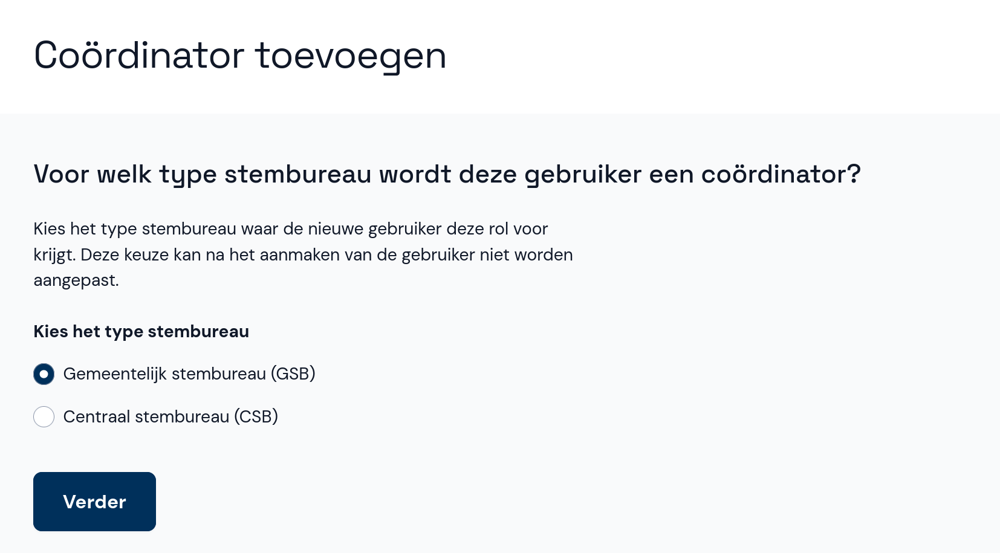
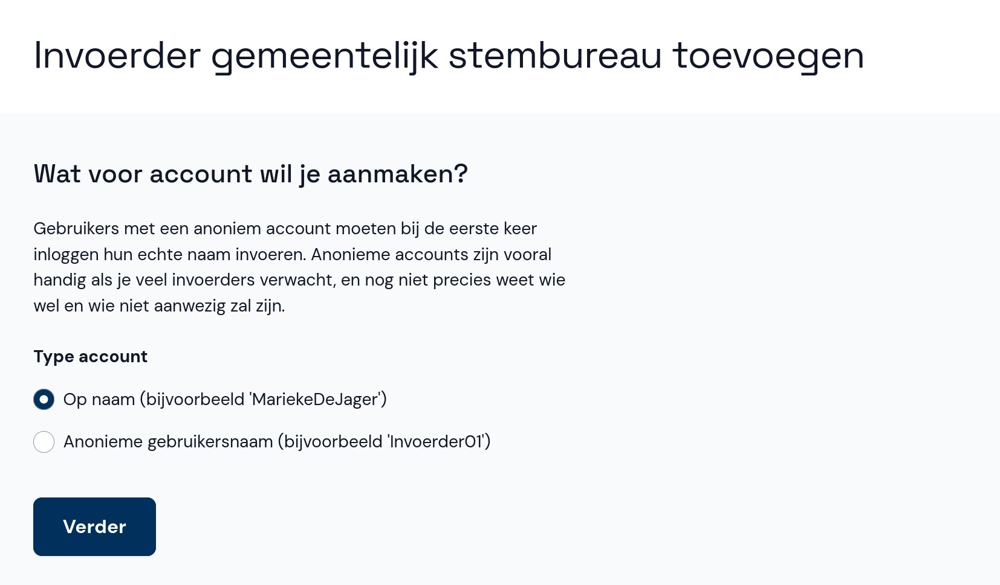
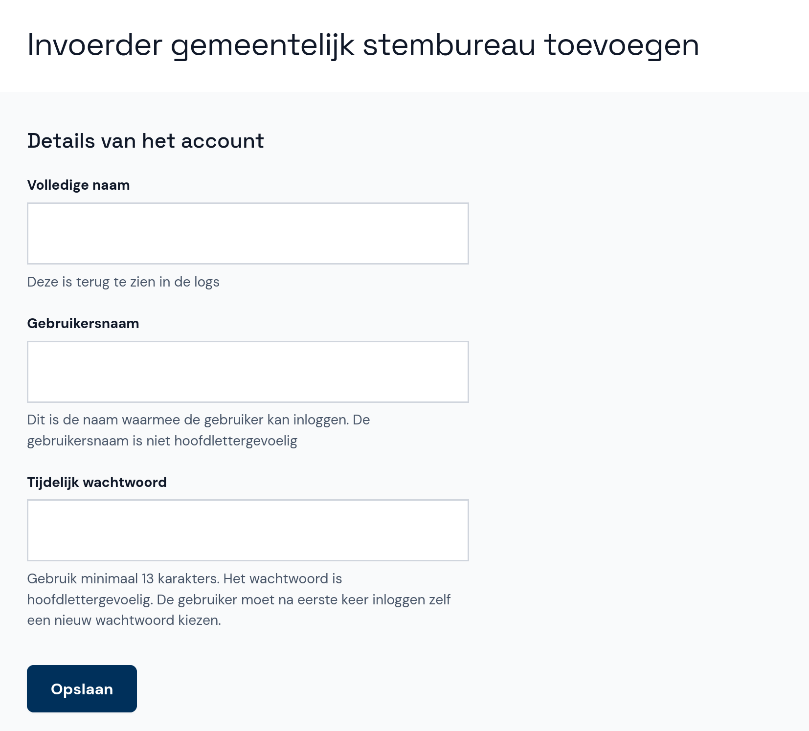

# Gebruiker toevoegen

- Selecteer onder **Gebruikers beheren** de optie **+ Gebruiker toevoegen**.
- Eerst kies je de rol van de nieuwe gebruiker: Beheerder, Coördinator of Invoerder. Dit kun je later niet meer aanpassen.

- Selecteer het type stembureau waarvoor de gebruiker een rol krijgt. In dit geval selecteer je **gemeentelijk stembureau (GSB)**.

- Als de gebruiker een invoerder is, kies je eerst of het account op naam staat of anoniem is. Een anoniem account blijft niet anoniem: de gebruiker moet bij de eerste keer inloggen altijd diens naam invoeren. Het is niet mogelijk anonieme accounts voor beheerders en coördinators te maken.

- Voer de gebruikersnaam, de volledige naam (behalve bij een anonieme invoerder) en een tijdelijk wachtwoord in. Bij de eerste keer inloggen moet de gebruiker het wachtwoord wijzigen.

