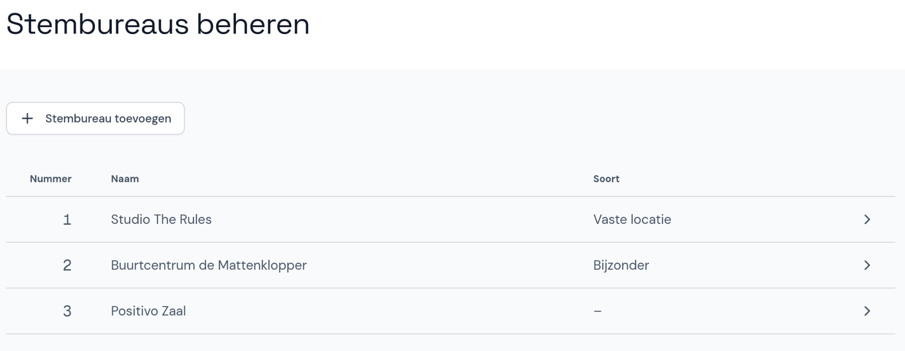

# Stembureaus beheren (gemeentelijk stembureau)

Wanneer je een verkiezing toevoegt voor het gemeentelijk stembureau, kun je stembureaus ook handmatig toevoegen, wijzigen en verwijderen om ervoor te zorgen dat de stembureaus in Abacus overeenkomen met de stembureaulijst die voorafgaand aan de verkiezingen is gepubliceerd.
Dit is ook handig als de gemeente een klein aantal stembureaus heeft en er geen EML-bestand met stembureaus (EML 110b) aanwezig is.

- Selecteer de verkiezing en klik onder *Over deze verkiezing* op **Stembureaus**.
- Stembureaus die al zijn toegevoegd zie je hier staan.
- Als de invoerfase al is gestart, kun je de stembureaus niet meer wijzigen. Alleen een coördinator kan de lijst met stembureaus dan nog bewerken.

