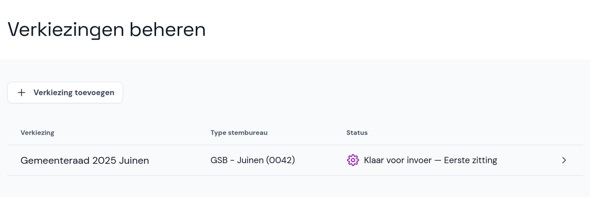

# Verkiezing toevoegen en beheren

Verzamel de gegevens die je nodig hebt om een verkiezing toe te voegen.
Zorg dat je de EML-bestanden met de verkiezingsdefinitie (EML 110a) en kandidatenlijsten (EML 230b) hebt. Deze bestanden komen uit de kandidaatstellingsmodule van OSV2020.

Voor het gemeentelijk stembureau gebruik je (optioneel) ook het EML-bestand met de stembureaus (EML 110b). Dit bestand wordt gegenereerd door de gemeente.

Als het aantal kiesgerechtigden in de gemeente **niet** in de EML 110b staat, zorg dan ook dat je dit aantal weet en invult.

## Verkiezing toevoegen

- In het hoofdmenu selecteer je **Verkiezingen beheren**.
- Selecteer onderaan of bovenaan de pagina **Verkiezing toevoegen**.

