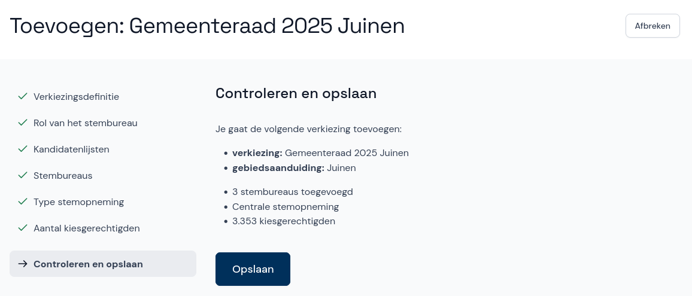
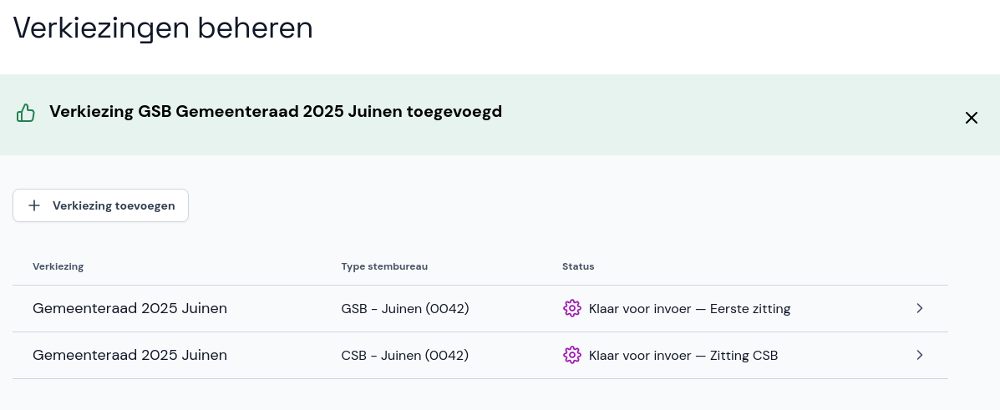

# Controleren en opslaan

- Controleer de gegevens over de verkiezing die je wil toevoegen en selecteer **Opslaan**.
- Als er iets niet klopt, selecteer je rechtsboven **Afbreken**. Daarna kun je opnieuw beginnen.

De verkiezing is nu toegevoegd en is zichtbaar in de lijst met verkiezingen.

Voor het **gemeentelijk stembureau** geldt dat de verkiezing pas klaar is voor invoer als je de lijst met stembureaus ook hebt toegevoegd. Als dit nog niet gebeurd is, heeft de verkiezing de status *Zitting voorbereiden*.
