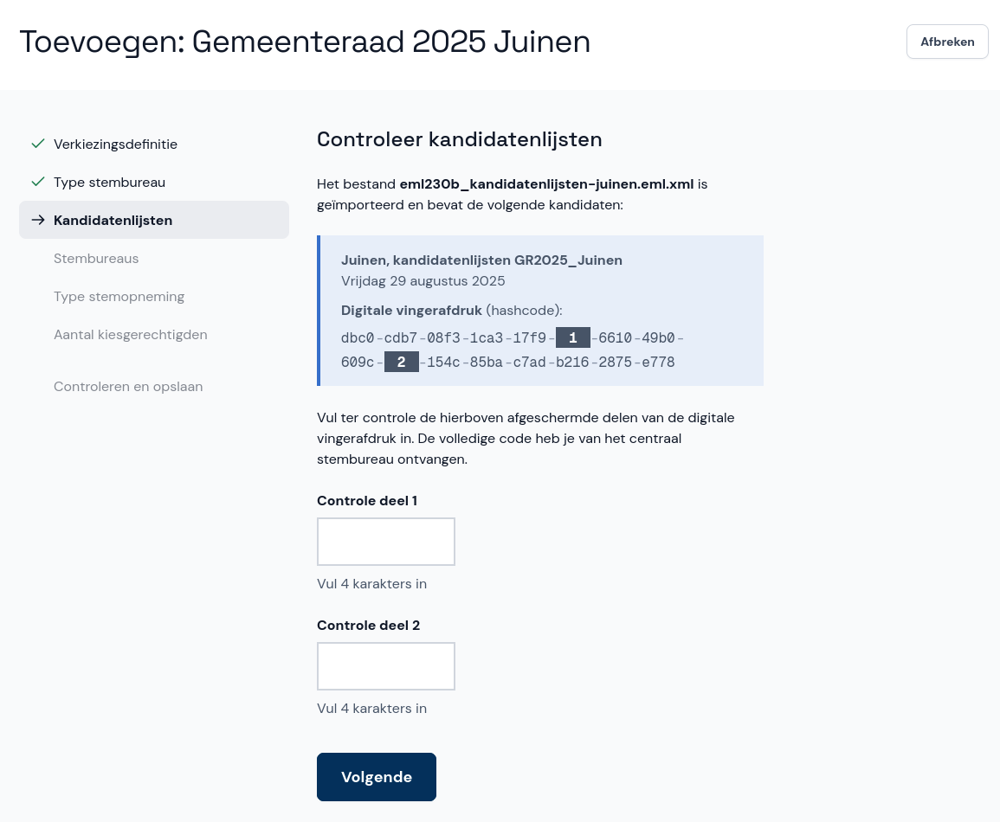

# Kandidatenlijsten

Voeg de kandidatenlijsten toe:

- Selecteer weer **Bestand kiezen** en voeg nu het EML-bestand met de kandidatenlijsten (EML 230b) toe.
- Net zoals bij de verkiezingsdefinitie voer je de ontbrekende delen van de digitale vingerafdruk in en selecteer je **Volgende**. De digitale vingerafdruk van het EML-bestand met de kandidatenlijsten (EML 230b) vind je in de PDF van *Model I 4: Proces-verbaal over geldigheid en nummering kandidatenlijsten*, onderaan elke pagina.

- Als je een verkiezing toevoegt voor het *gemeentelijk stembureau*, ga je door naar de volgende stap.
- Als je een verkiezing toevoegt voor het *centraal stembureau*, ga je direct door naar [Controleren en opslaan](controleren-opslaan.md). **Let op**: bij een verkiezing voor het centraal stembureau zie je aan de linkerkant van het scherm niet alle stappen in de bovenstaande afbeelding, maar alleen de stappen die relevant zijn voor het centraal stembureau.
