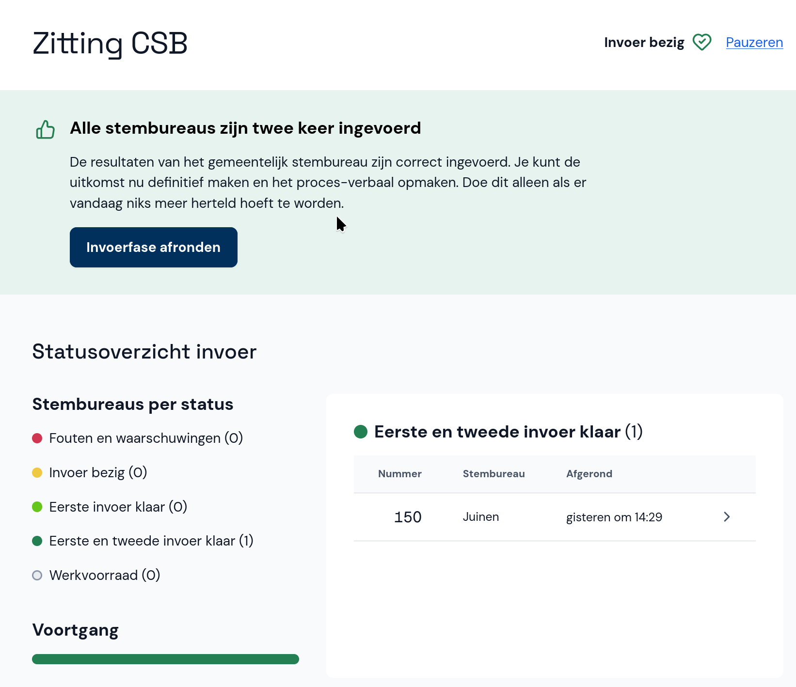

# Zitting afronden en proces-verbaal opmaken

Wanneer alle resultaten twee keer correct zijn ingevoerd, kun je de uitslag definitief maken en het proces-verbaal opmaken.

Selecteer **Invoerfase afronden** en doe dit nogmaals ter bevestiging.

