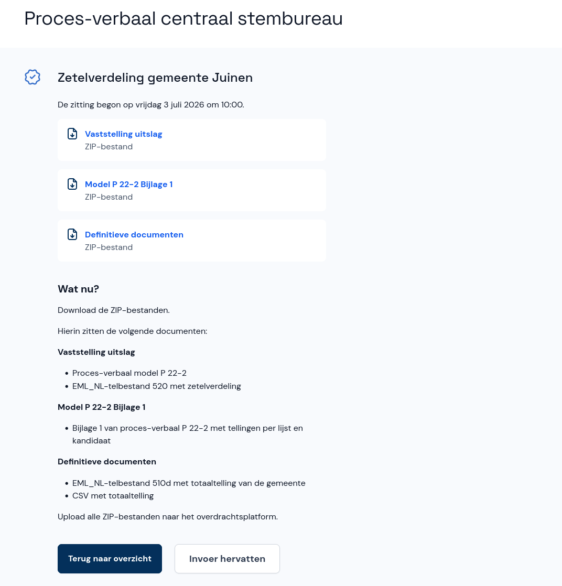

# Documenten downloaden

De invoer van het centraal stembureau is afgerond. Op deze pagina download je drie ZIP-bestanden met daarin de volgende documenten:

- Proces-verbaal model P 22-2
- EML_NL-telbestand 520 met de zetelverdeling
- Bijlage 1 van het proces-verbaal P 22-2 met tellingen per lijst en kandidaat
- EML_NL-telbstand 510d met de totaaltelling van de gemeente
- CSV-bestand met de totaaltelling

Upload de ZIP-bestanden naar het overdrachtsplatform.

- Selecteer **Terug naar overzicht** om naar het overzicht van de zitting te gaan. Hier kun je de zetelverdeling en invoer nogmaals bekijken.
- Als je toch nog iets wil wijzigen selecteer je **Invoer hervatten**.
