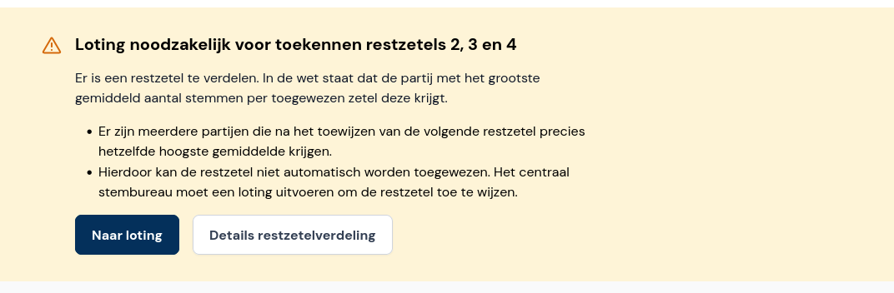
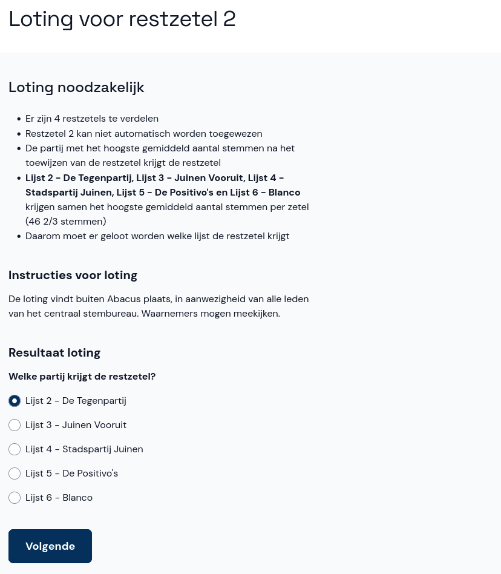
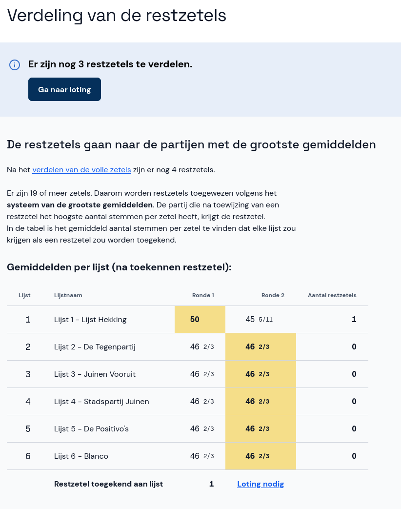
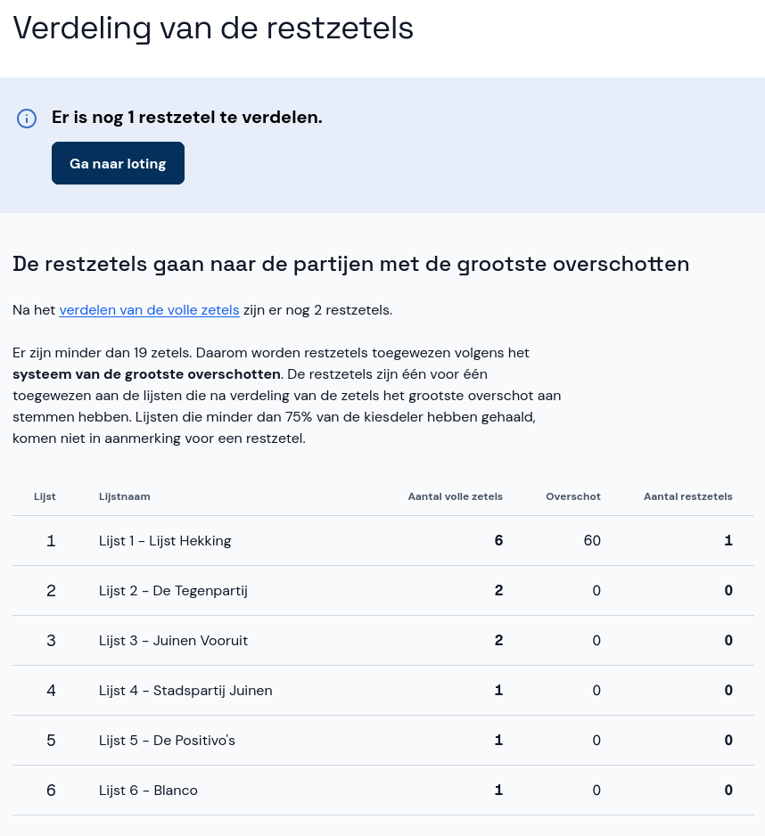
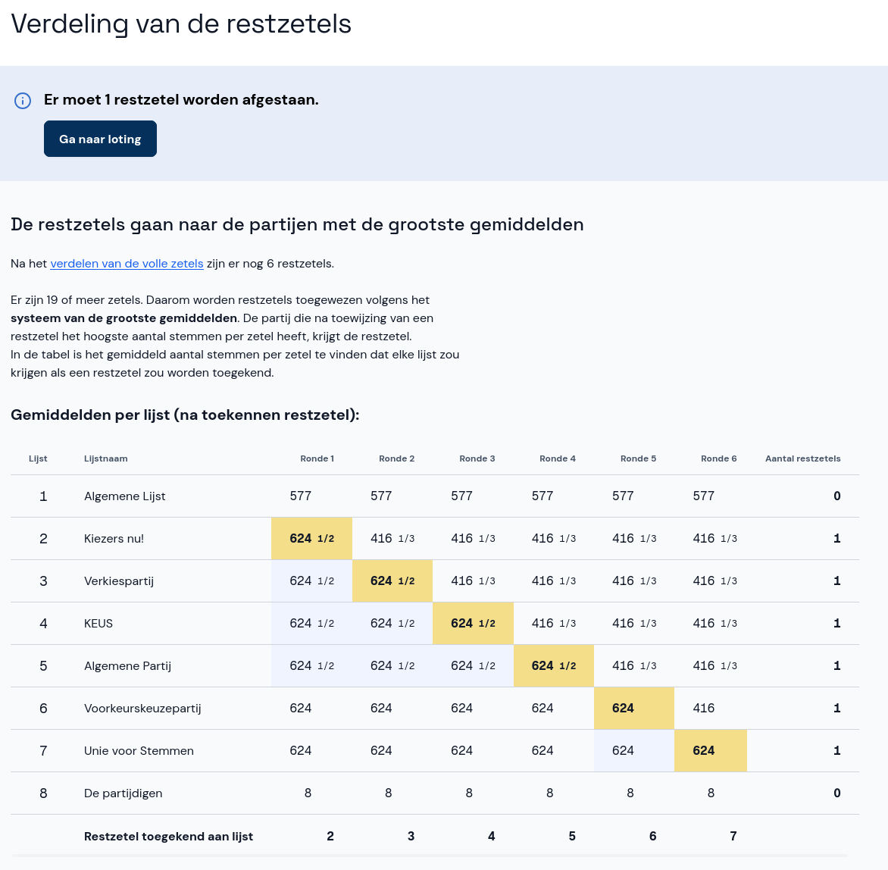
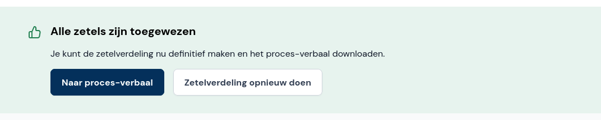

# Loting en naar proces-verbaal

Als alle zetels zijn toegewezen, hoef je niets meer te doen en kun je direct doorgaan naar het [proces-verbaal](#naar-proces-verbaal).

In sommige gevallen kunnen niet alle restzetels automatisch worden toegewezen en is loting nodig. In een geel vak staat aangegeven waarom de loting noodzakelijk is en hoeveel restzetels op deze manier moeten worden toegewezen.

## Naar loting

- Klik op **Naar loting** om het resultaat van de loting in te voeren. Voor meer details klik je eerst op **Details restzetelverdeling** en dan op **Ga naar loting**.
- De loting vindt buiten Abacus plaats, in aanwezigheid van alle leden van het centraal stembureau.
- Voer het resultaat van de loting in door het juiste keuzerondje te selecteren en klik op **Volgende**.
- Herhaal de bovenstaande stappen voor alle te verdelen restzetels.

## Details restzetelverdeling

- Klik op **Details restzetelverdeling** om precies te zien hoe de restzetels worden toegewezen.
- Bij het **systeem van de grootste gemiddelden** zie je voor elke ronde welk aantal stemmen per zetel elke partij heeft en aan welke lijst de zetel is toegekend. Er is loting nodig als alle (overige) partijen een gelijk aantal stemmen per zetel hebben.

- Bij het **systeem van de grootste overschotten** zie je aan welke partijen al een zetel is toegewezen op basis van het grootste overschot aan stemmen. Als alle (overige) partijen een gelijk overschot hebben, is loting nodig.

- Ook kan loting noodzakelijk zijn omdat een lijst de volstrekte meerderheid van stemmen heeft gekregen, maar niet de volstrekte meerderheid aan zetels heeft. Er moet dan een restzetel worden afgestaan.

## Naar proces-verbaal

- Wanneer alle zetels zijn toegewezen, klik je op **Naar proces-verbaal**. Als de details van de zitting nog niet zijn ingevoerd, doe je dit nu. Daarna selecteer je nogmals **Naar proces-verbaal**.
- Als je toch nog iets wil wijzigen, klik je op **Zetelverdeling opnieuw doen**. Je kunt dan de overleden kandidaten en de loting van restzetels opnieuw invoeren.

