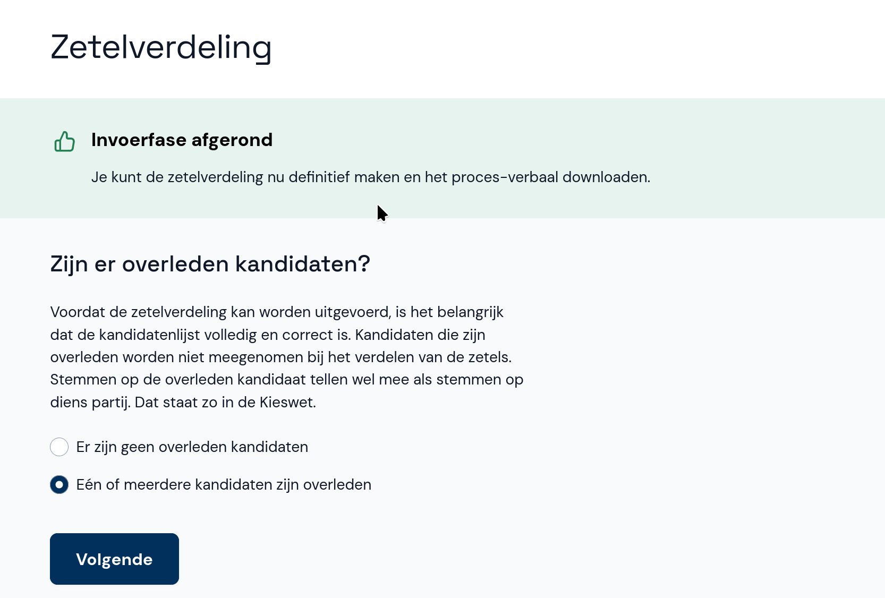
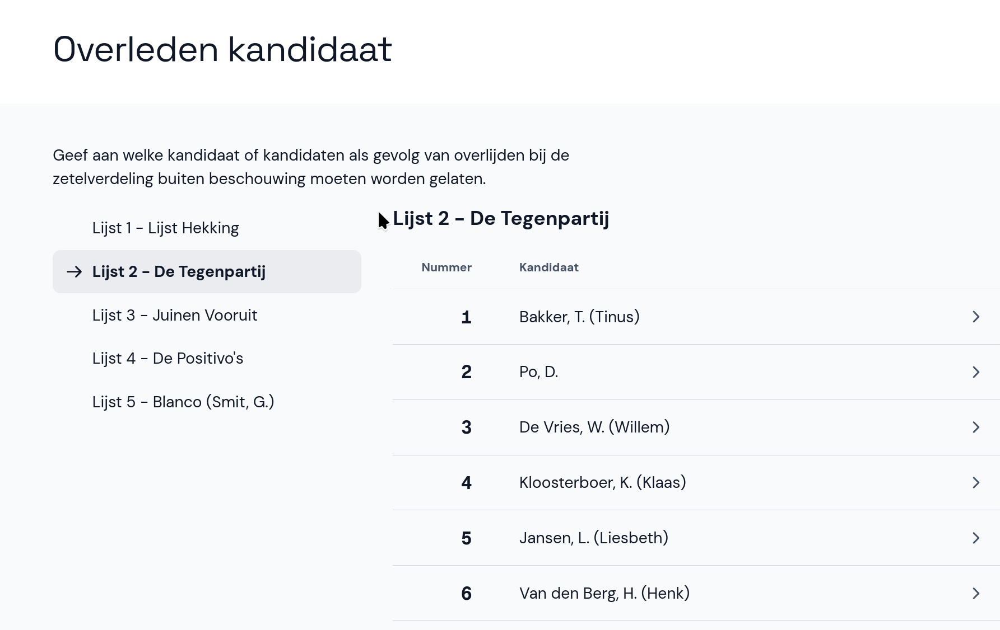
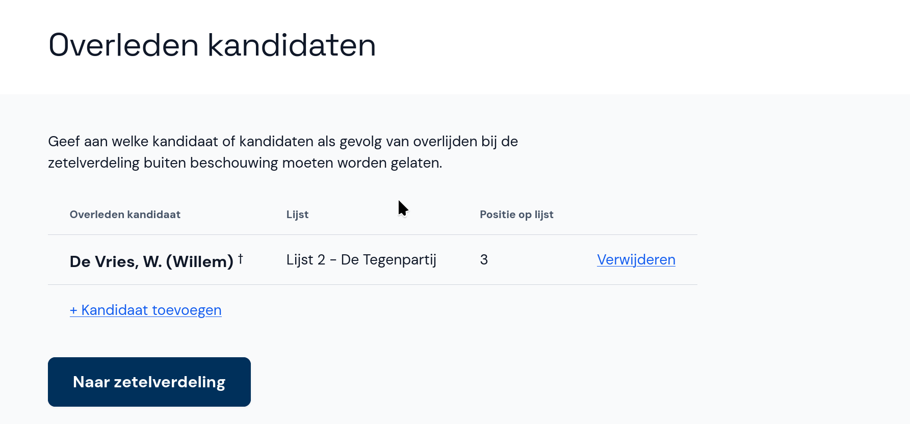

# Overleden kandidaten

Het kan zijn dat een kandidaat tijdens de verkiezingsperiode is overleden. In dit geval kan de kandidaat niet gekozen worden en moet de kandidaat worden uitgesloten van de zetelverdeling.

- Als er geen overleden kandidaten zijn, selecteer je **Er zijn geen overleden kandidaten**. Je gaat dan direct door naar de zetelverdeling.
- Als er wel overleden kandidaten zijn, selecteer je **Eén of meerdere kandidaten zijn overleden**.

- Selecteer links de lijst en rechts de kandidaat die is overleden.

- De kandidaat wordt nu gemarkeerd als overleden. Als je dit ongedaan wil maken, selecteer je achter de overleden kandidaat de optie **Verwijderen**.
- Als je nog een overleden kandidaat wil toevoegen, selecteer je **+ Kandidaat toevoegen** en voeg je de volgende kandidaat toe.
- Wanneer je klaar bent, selecteer je **Naar zetelverdeling**.

