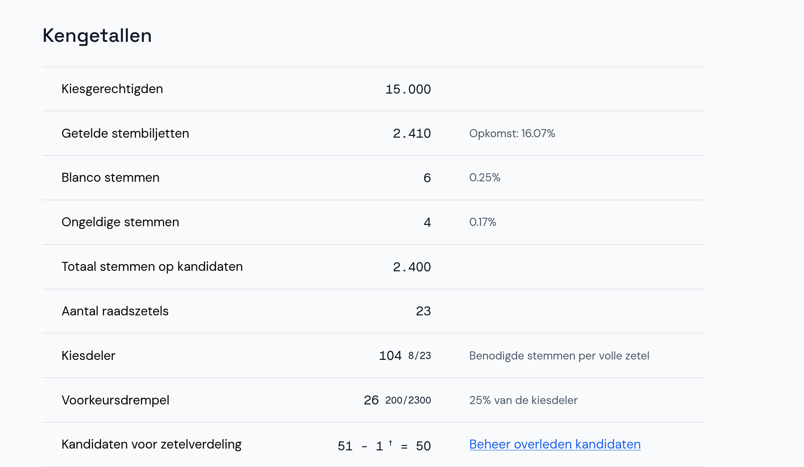
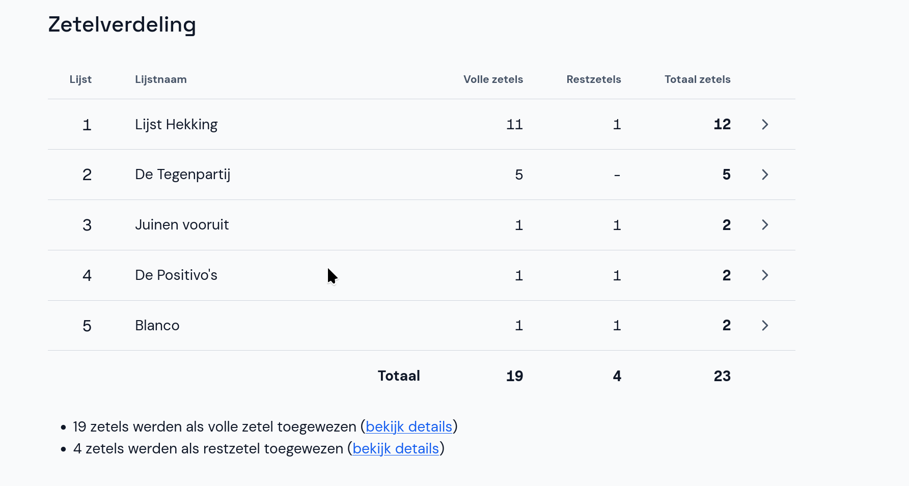
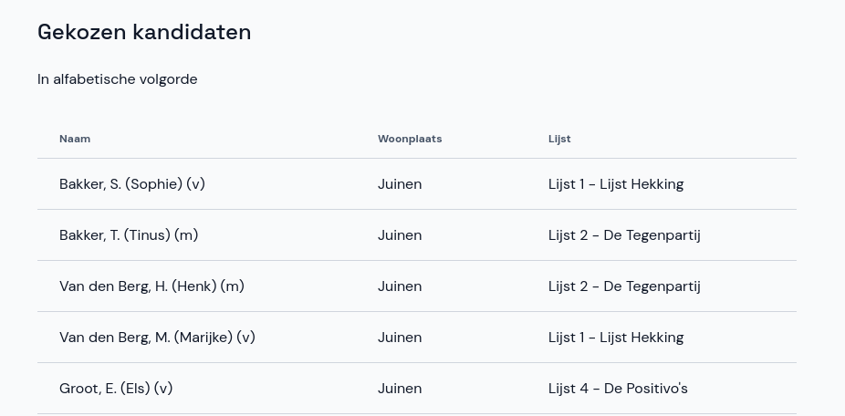

# Berekening van de zetelverdeling

Op de pagina **Zetelverdeling** staat precies aangegeven hoe de zetelverdeling is berekend en op welke manier de (rest)zetels zijn toegekend.

Bovenaan staan de kengetallen, met onder andere het opkomstpercentage, de kiesdeler en de voorkeursdrempel. Als het nodig is kun je de overleden kandidaten nog aanpassen door op **Beheer overleden kandidaten** te klikken.

Op het tweede deel van de pagina staat de daadwerkelijke zetelverdeling.

- Klik op een lijst om te zien hoe de kandidaten in deze lijst gekozen zijn.
- Onder de lijsten zie je hoeveel zetels als volle zetels en restzetels zijn toegewezen. Klik op **bekijk details** om te zien hoe de verdeling van volle zetels en restzetels is berekend.

Onderaan de pagina staan alle gekozen kandidaten in alfabetische volgorde.

