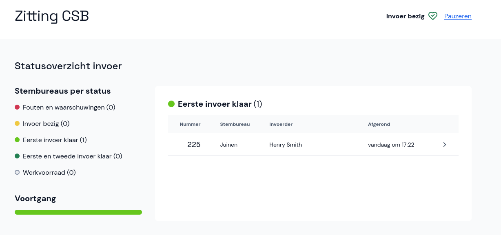

# Statusoverzicht steminvoer

Selecteer in het hoofdmenu onder de naam van de verkiezing **Statusoverzicht invoer**. Je kunt ook eerst de verkiezing en daarna **Bekijk voortgang** selecteren.

Op deze pagina zie je in één oogopslag wat de status van de invoer is en wat er nog moet worden ingevoerd. Hier zie je ook welke invoer speciale aandacht van jou als coördinator nodig heeft vanwege [fouten en/of waarschuwingen](../../spiekbrief/foutcodes/foutcodes-csb.md).

