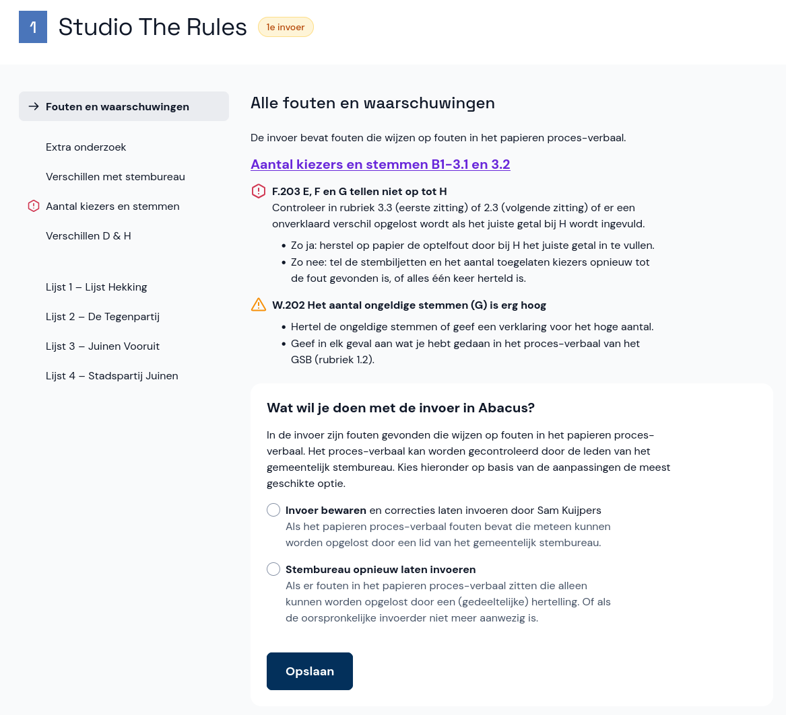

# Fouten en waarschuwingen

Zowel tijdens als na de invoer kunnen er fouten of waarschuwingen ontstaan.

**Tijdens de invoer** kunnen de invoerders te maken hebben met verschillende fouten of waarschuwingen. Zij moeten dit met jou overleggen om tot een oplossing te komen.

**Na de invoer** zie je bovenaan in het statusoverzicht van de invoer of er fouten of waarschuwingen zijn. Selecteer het stembureau om ze te bekijken en behandelen.

