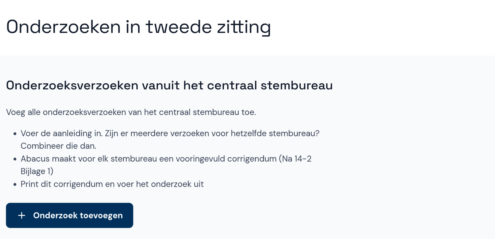
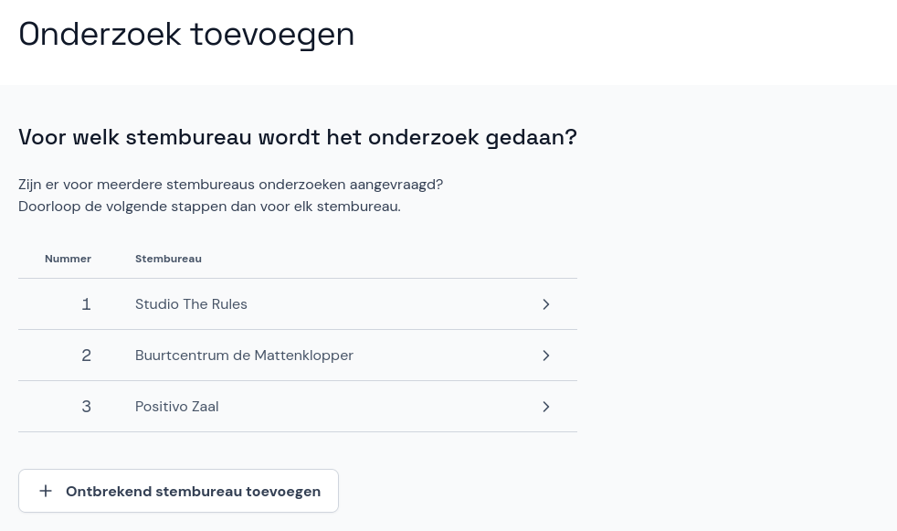
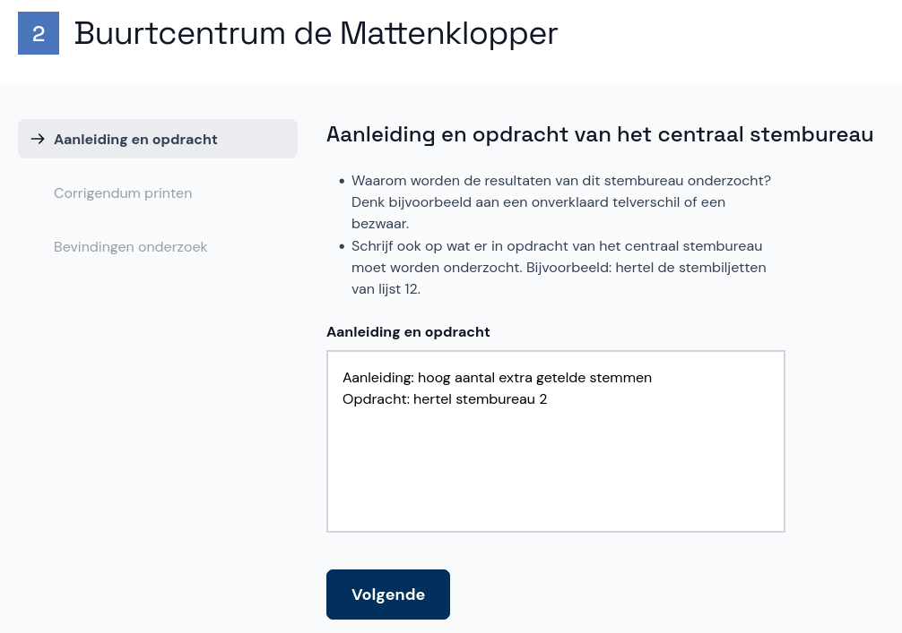
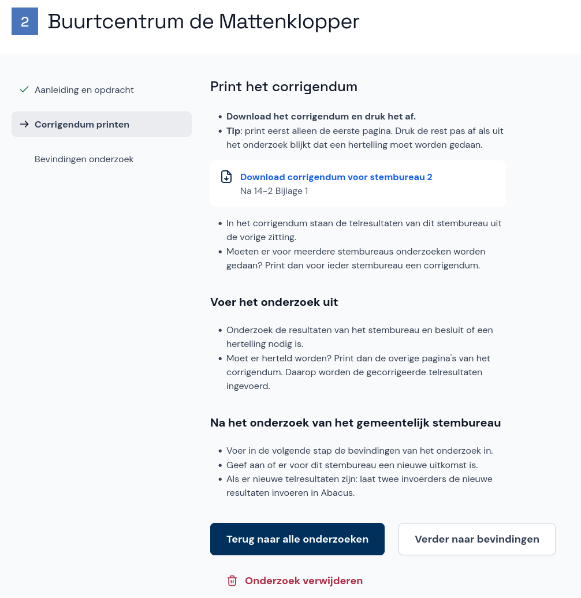
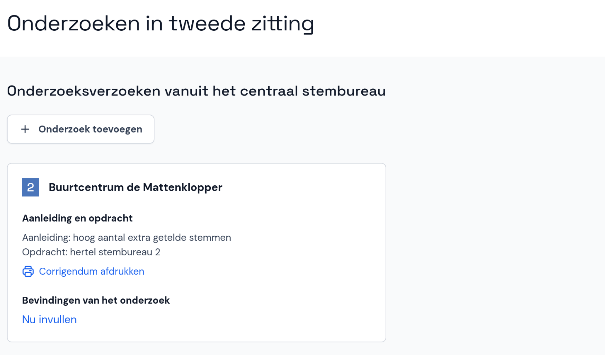

# Nieuwe zitting

Als het centraal stembureau hier opdracht voor heeft gegeven, voeg je een nieuwe zitting toe. Wil het gemeentelijk stembureau zelf een fout herstellen en is de zitting nog niet afgesloten door de voorzitter? Ga dan verder in de eerste zitting.

- Selecteer onder de bestaande zitting **Nieuwe zitting voorbereiden** en in de pop-up **Ja, zitting toevoegen**.

- Je ziet nu een tweede zitting met de status *Zitting voorbereiden*.

- Onder **Details van de zitting** voer je de plaatsnaam, datum en starttijd van de zitting in. Dit werkt net zoals bij de eerste zitting, kijk hiervoor bij [Details van de zitting](/coordinator/verkiezing-beheren/details-zitting.md).
- Selecteer **Aangevraagde onderzoeken** en vervolgens **+ Onderzoek toevoegen**.

- Kies het stembureau waarvoor je een onderzoek wil toevoegen.
- Ontbreekt het stembureau in de lijst, selecteer dan **Ontbrekend stembureau toevoegen**. Dit werkt hetzelfde als in de eerste zitting, kijk hiervoor bij [Stembureau handmatig toevoegen](/coordinator/stembureaus-beheren/sb-handmatig-toevoegen.md). Daarna ga je terug naar de nieuwe zitting en herhaal je de bovenstaande stappen.

- Schrijf op welke aanleiding en opdracht het centraal stembureau heeft gegeven voor het onderzoek en selecteer **Volgende**.

- Nu kun je het corrigendum afdrukken en het onderzoek uitvoeren volgens de instructies op het scherm.

- Als er meer onderzoeken nodig zijn, selecteer je **Terug naar alle onderzoeken** om terug te gaan naar het overzicht met onderzoeken. Selecteer dan weer **+ Onderzoek toevoegen**.

