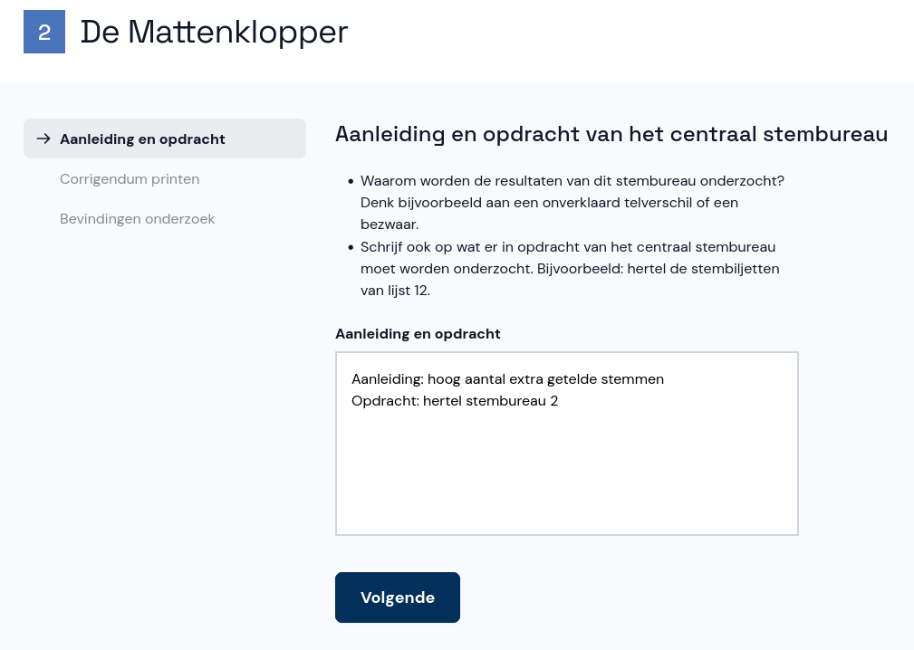

# Nieuwe zitting

Als het centraal stembureau hier opdracht voor heeft gegeven, voeg je een nieuwe zitting toe. Dit doe je met de knop **Nieuwe zitting voorbereiden** onder de bestaande zitting.

> <i class="fa-solid fa-circle-exclamation"></i> **Let op**  
> Wil het gemeentelijk stembureau zelf een fout herstellen en is de zitting nog niet afgesloten door de voorzitter? Ga dan verder in de eerste zitting.

Net als bij de eerste zitting voer je onder **Details van de zitting** de plaatsnaam, datum en starttijd van de zitting in.

## Onderzoek toevoegen

In de nieuwe zitting klik je op **Aangevraagde onderzoeken** om een of meerdere onderzoeken toe te voegen.

Selecteer het stembureau waarvoor je een onderzoek wil toevoegen. Ontbreekt het stembureau in de lijst, dan voeg je het stembureau toe met de knop onderaan de lijst. Dit werkt op dezelfde manier als in de eerste zitting. Daarna ga je terug naar de nieuwe zitting en herhaal je de bovenstaande stappen.

Schrijf op wat de aanleiding is en welke opdracht het centraal stembureau heeft gegeven voor het onderzoek.

Nu kun je het corrigendum afdrukken en het onderzoek uitvoeren volgens de instructies op het scherm. Als er meer onderzoeken nodig zijn, klik je op **Terug naar alle onderzoeken** om er nog een toe te voegen. Als je klaar bent kun je verder naar de bevindingen.
