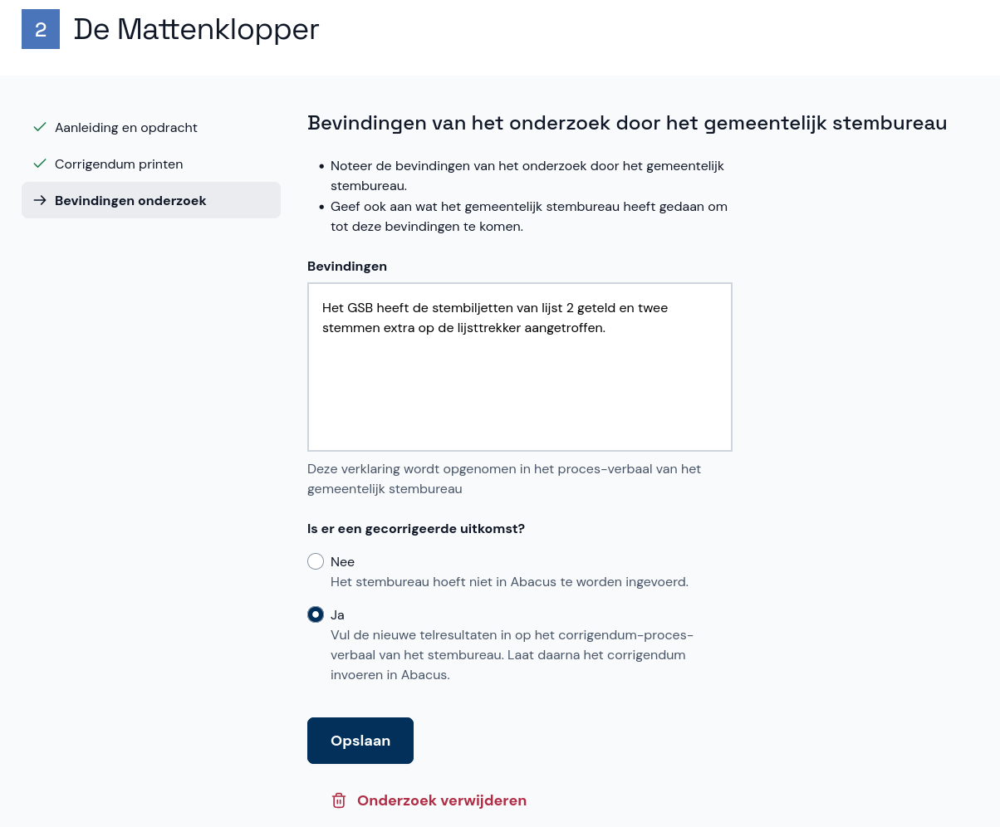

# Bevindingen en invoerfase

Na het afronden van een onderzoek is het tijd om de bevindingen in te voeren. Klik op **Invoerfase starten** om de invoer van de bevindingen en eventuele telresultaten te starten.

Neem de bevindingen over zoals ze in het corrigendum zijn opgeschreven en sla het onderzoek op.

In het overzicht van de onderzoeken zie je wat je moet doen en wat de status van elk onderzoek is. Is de uitslag niet gecorrigeerd, dan hoef je niets meer te doen. Is de uitslag wel gecorrigeerd, dan laat je twee invoerders het corrigendum overnemen in Abacus.

## Zitting afronden

Nadat de stembureaus met een gecorrigeerde uitkomst opnieuw twee keer zijn ingevoerd, kun je de nieuwe zitting afronden. Dit doe je op dezelfde manier als bij de eerste zitting. Kijk hiervoor bij [Zitting afronden en proces-verbaal opmaken](../afronden-pv.md).
