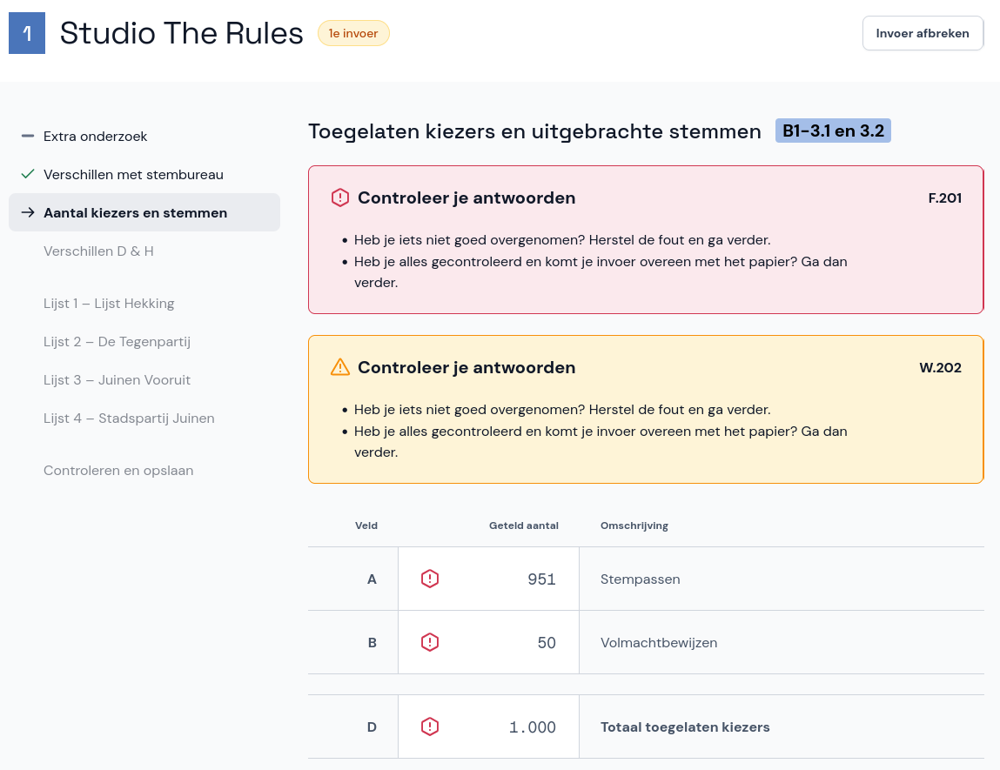
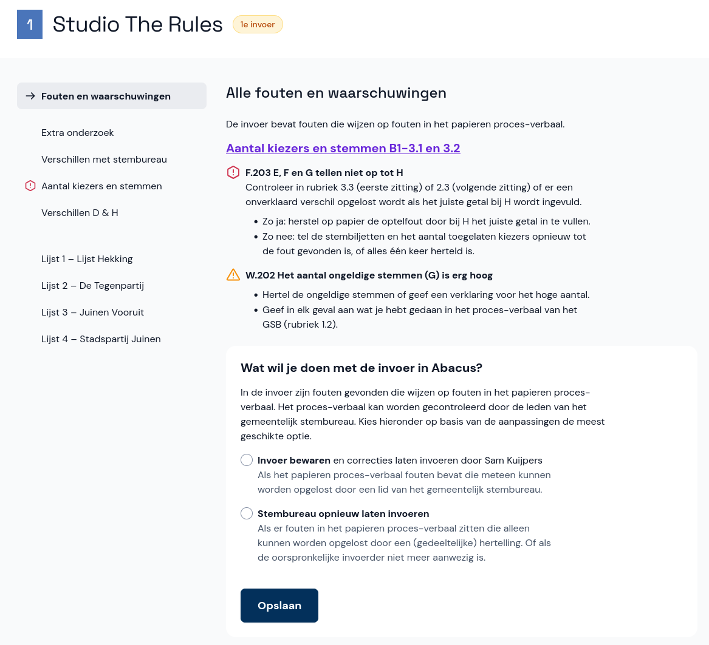

# Fouten en waarschuwingen

Zowel tijdens als na de invoer kunnen er fouten of waarschuwingen ontstaan.

**Tijdens de invoer** kunnen de invoerders te maken hebben met verschillende fouten of waarschuwingen. Zij moeten dit met jou overleggen om tot een oplossing te komen.

**Na de invoer** zie je bovenaan in het statusoverzicht van de invoer of er fouten of waarschuwingen zijn. Selecteer het stembureau om ze te bekijken en behandelen.

## Controleren en corrigeren

In het algemeen gelden de volgende regels voor fouten en waarschuwingen:

- Een waarschuwing betekent niet per definitie dat je iets moet aanpassen, maar geeft soms wel aanleiding om de invoer en het proces-verbaal nog eens te controleren.
- Heeft de invoerder een invoerfout gemaakt, maar klopt het papieren proces-verbaal wel? Laat de invoerder dan de invoer corrigeren.
- Zit er een schrijffout in het papieren proces-verbaal? Dan moet het proces-verbaal aangepast of gecorrigeerd worden. Overleg met een lid van het GSB hoe je dit moet doen.

Bij sommige fouten en waarschuwingen moet je specifieke handelingen uitvoeren. Abacus geeft dan duidelijk aan wat je moet doen. Meer informatie over oplossingen en handelingen voor de fouten en waarschuwingen vind je in de [spiekbrief](../../spiekbrief/foutcodes/).
