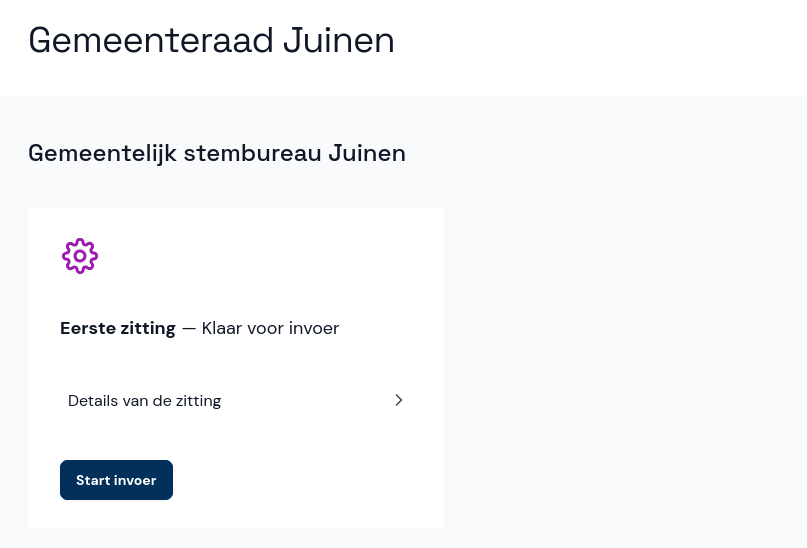

# Zitting starten

De zitting heeft nu de status *Klaar voor invoer*. Selecteer de knop **Start invoer** om de zitting te starten. Nu kunnen invoerders aan de slag.

Laat alle aantallen twee keer invoeren door twee verschillende invoerders. Zodra de eerste invoer is begonnen, verandert de status van de verkiezing in *Invoer bezig*.
