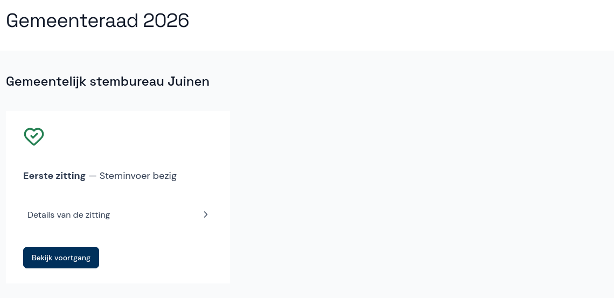

# Zitting voorbereiden

Voordat de zitting kan beginnen, controleer je of alle gegevens kloppen. In het menu selecteer je onder **Verkiezingen** de naam van de verkiezing. Je ziet dan een overzicht van de zitting en de status van de invoer.

Direct onder de zitting zie je alle gegevens over deze verkiezing.

