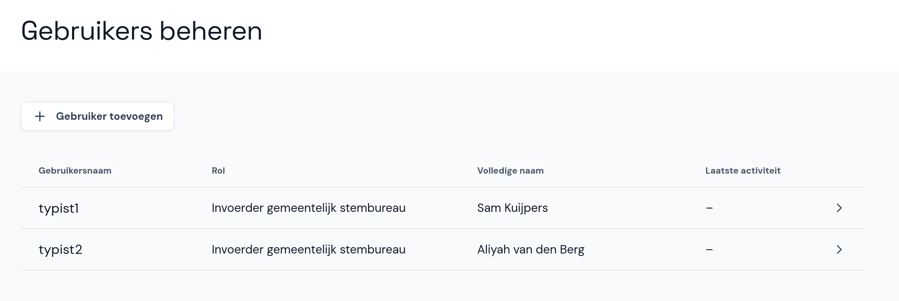

# Gebruikers beheren

Als coördinator kun je gebruikers toevoegen, wijzigen of verwijderen. Kies hiervoor in het hoofdmenu **Gebruikers beheren**.

- Wanneer je een account toevoegt, selecteer je eerst of het account op naam staat of anoniem is. Voor een anoniem account moet de gebruiker bij de eerste keer inloggen de naam invoeren.
- Voer de gebruikersnaam, de volledige naam (behalve bij een anonieme invoerder) en een tijdelijk wachtwoord in. Bij de eerste keer inloggen moet de gebruiker het wachtwoord wijzigen.

> <i class="fa-solid fa-circle-exclamation"></i> **Let op**  
> Je kunt alleen invoerders beheren. Alleen een beheerder kan ook accounts met de rol van beheerder of coördinator beheren.

## Gebruiker wijzigen of verwijderen

In hetzelfde menu kun je gebruikers ook wijzigen of verwijderen. Klik op de gebruiker en wijzig de gegevens, of verwijder de gebruiker met de rode knop onderaan het scherm. De gebruikersnaam en de rol kunnen niet gewijzigd worden.
