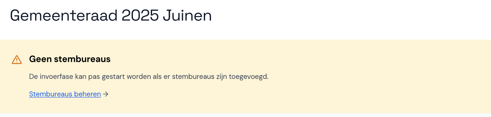
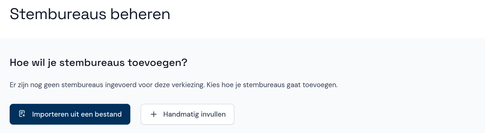

# Stembureaus toevoegen

Zonder de lijst met stembureaus kan de invoerfase nog niet worden gestart en zie je de onderstaande melding. Klik hierop om de stembureaus toe te voegen.

> <i class="fa-solid fa-circle-exclamation"></i> **Let op**  
> Zorg dat de stembureaus in Abacus overeenkomen met de voor de verkiezing gepubliceerde lijst. Als er afwijkingen zijn, moeten deze worden opgenomen in het proces-verbaal.

Als je een EML-bestand met stembureaus (EML 110b) hebt, kun je dit direct importeren. Je kunt stembureaus ook handmatig toevoegen om ervoor te zorgen dat de stembureaus in Abacus overeenkomen met de stembureaulijst die voorafgaand aan de verkiezingen is gepubliceerd.

> <i class="fa-solid fa-circle-exclamation"></i> **Let op**  
> Een bestand importeren is niet meer mogelijk als er al stembureaus aanwezig zijn.

Als je een stembureau handmatig invult, voer je de gegevens van het stembureau in en geef je aan welke soort stembureau het is. Als het aantal kiesgerechtigden van het stembureau bekend is, kun je dit invullen, maar dat hoeft niet.

## Stembureau wijzigen of verwijderen

In het menu met stembureaus kun je stembureaus ook wijzigen of verwijderen. Klik op het stembureau en wijzig de gegevens, of verwijder het stembureau met de rode knop onderaan het scherm.
