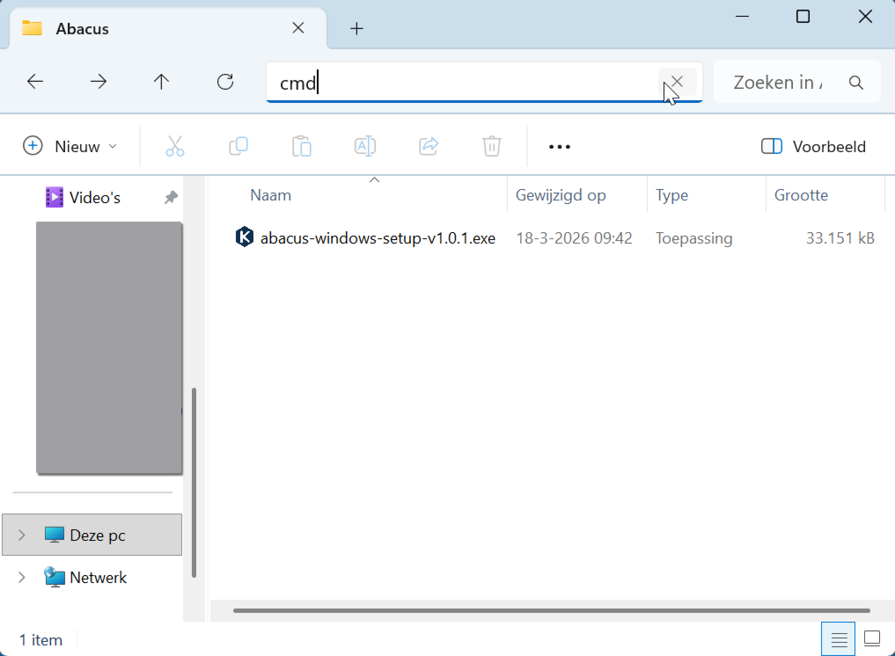

# Authenticiteit van Abacus vaststellen

Voordat je Abacus installeert, controleer je of de inhoud van het installatiebestand gelijk is aan de inhoud van Abacus zoals gepubliceerd door de Kiesraad. Deze stap is een belangrijke waarborg waarmee we tot betrouwbare verkiezingsresultaten komen.

Je vergelijkt de hashcode van het Abacus-bestand met de hashcode die op de website van de Kiesraad staat. Als de hashcode overeenkomt weet je dat je de officiële, door de Kiesraad verspreide versie van Abacus installeert. De werkwijze om de hashcode te bepalen hangt af van je besturingssysteem.

## Authenticiteit vaststellen op Windows

Op Windows toon je de hashcode met de opdracht `certutil`. In deze instructies gebruiken we hiervoor de opdrachtprompt. Als je liever PowerShell gebruikt, dan kan dat ook.

- Ga in de Verkenner naar de locatie van het installatiebestand.
- Typ in de adresbalk van de verkenner `cmd` en druk op Enter. Hiermee open je de opdrachtprompt.



- Voer vervolgens de volgende opdracht uit, waarbij `bestandsnaam` de naam is van het Abacus-bestand:

```
certutil -hashfile bestandsnaam.exe SHA256
```

De hashcode staat onder de opgegeven opdracht. Deze hashcode controleer je met de hashcode die op de website van de Kiesraad staat. Als de hashcode identiek is, kun je Abacus installeren.


### Alternatief: 7zip

Als je 7zip hebt geïnstalleerd, kun je de hashcode ook controleren aan de hand van dit programma.

- Klik met de rechtermuisknop op het installatiebestand en ga naar het submenu **7zip**.
- Onderaan ga je naar het submenu **CRC SHA**. In dit menu klik je op **SHA-256**.

De hashcode staat op de onderste regel in het venster. Deze hashcode controleer je met de hashcode die op de website van de Kiesraad staat. Als de hashcode identiek is, kun je Abacus installeren.


## Authenticiteit vaststellen op Linux

Voor Linux gebruik je de opdracht `sha256sum` in een terminal.

- Open een terminal en ga naar de locatie van het installatiebestand.
- Voer vervolgens de volgende opdracht uit, waarbij `bestandsnaam` de naam is van het Abacus-bestand:

```
sha256sum bestandsnaam.tar.gz
```

De hashcode staat vervolgens onder de opgegeven opdracht. Deze hashcode controleer je met de hashcode die op de website van de Kiesraad staat. Als de hashcode identiek is, kun je Abacus installeren.


## Hashcode klopt niet

Klopt de hashcode niet? Controleer eerst of je het juiste installatiebestand met het juiste versienummer gebruikt. Als de bestandsnaam correct is, maar de hashcode nog steeds niet klopt, download het bestand dan nog een keer en probeer het opnieuw.

Als je dit allemaal hebt geprobeerd en de authenticiteit van het installatiebestand nog steeds niet kunt vaststellen, neem dan contact op met de Kiesraad.
