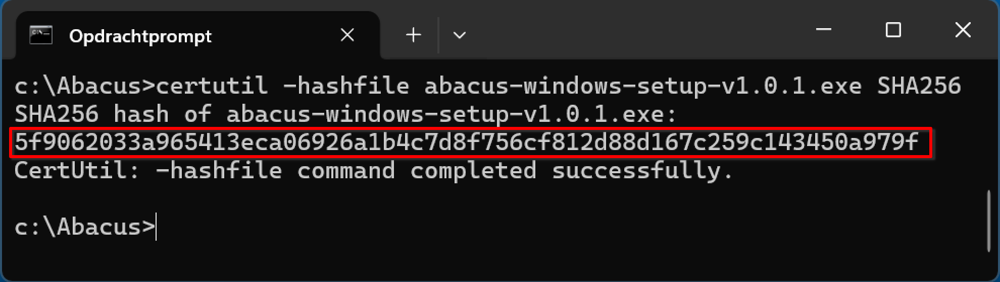
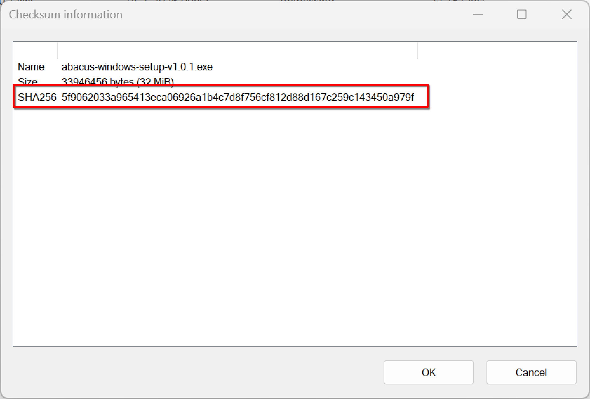
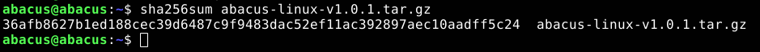

# Authenticiteit van Abacus vaststellen

Voordat je Abacus installeert, controleer je of de inhoud van het installatiebestand gelijk is aan de inhoud van Abacus zoals gepubliceerd door de Kiesraad. Vergelijk daarvoor de hashcode van het Abacus-bestand met de hashcode die op de website van de Kiesraad staat. De werkwijze om de hashcode te bepalen hangt af van je besturingssysteem.

## Authenticiteit vaststellen op Windows

Voor Windows gebruik je de opdracht `certutil` in een opdrachtprompt of PowerShell.

- Open de opdrachtprompt of PowerShell. De opdrachtprompt open je door naar **Start** te gaan en dan "cmd" te typen.
- Ga naar de locatie van het installatiebestand.
- Voer vervolgens de volgende opdracht uit, waarbij `bestandsnaam` de naam is van het Abacus-bestand:

```
certutil -hashfile bestandsnaam.exe SHA256
```

De hashcode staat onder de opgegeven opdracht. Deze hashcode controleer je met de hashcode die op de website van de Kiesraad staat. Als de hashcode identiek is, kun je Abacus installeren.



### Alternatief: 7zip

Als je 7zip hebt geïnstalleerd, kun je de hashcode ook controleren aan de hand van dit programma.

- Klik met de rechtermuisknop op het installatiebestand en ga naar het submenu **7zip**.
- Onderaan ga je naar het submenu **CRC SHA**. In dit menu klik je op **SHA-256**.

De hashcode staat op de onderste regel in het venster. Deze hashcode controleer je met de hashcode die op de website van de Kiesraad staat. Als de hashcode identiek is, kun je Abacus installeren.



## Authenticiteit vaststellen op Linux

Voor Linux gebruik je de opdracht `sha256sum` in een terminal.

- Open een terminal en ga naar de locatie van het installatiebestand.
- Voer vervolgens de volgende opdracht uit, waarbij `bestandsnaam` de naam is van het Abacus-bestand:

```
sha256sum bestandsnaam.tar.gz
```

De hashcode staat vervolgens onder de opgegeven opdracht. Deze hashcode controleer je met de hashcode die op de website van de Kiesraad staat. Als de hashcode identiek is, kun je Abacus installeren.

