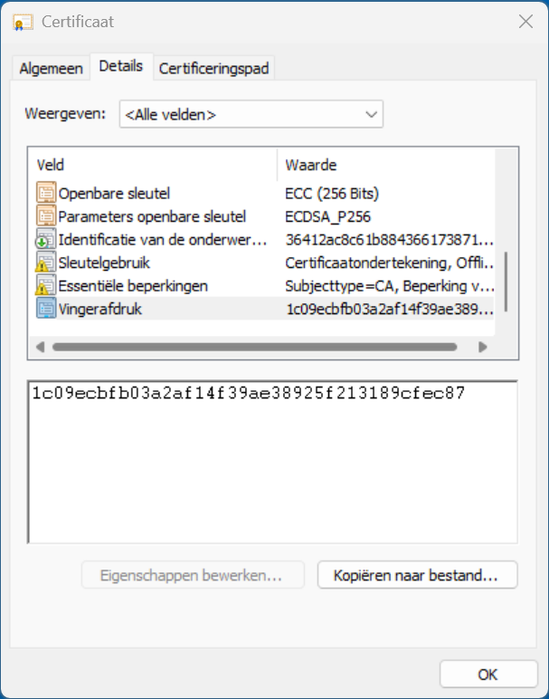

# Beveiligingscertificaat

Abacus wordt geïnstalleerd met een TLS-beveiligingscertificaat, zodat de verbinding tussen de Abacus-server en de clients versleuteld is.

Op **Windows** wordt het beveiligingscertificaat automatisch geïnstalleerd tijdens de installatie van Abacus. Daarna installeer je het certificaat zelf op alle clients, zodat ze `https` gebruiken en een versleutelde verbinding hebben met de server.

Op **Linux** wordt het beveiligingscertificaat niet automatisch geïnstalleerd op de server. Installeer het certificaat dus op alle computers, inclusief de server.

**Let op:** als je het certificaat systeembreed installeert, lukt het mogelijk niet om het certificaat in de browser te gebruiken. Firefox gebruikt bijvoorbeeld een eigen certificaatbeheerder. Als het nog niet werkt, installeer je het certificaat in de browser volgens de instructies hieronder.

## Certificaat kopiëren

Eerst kopieer je het certificaat naar de clients.

- Op de server open je de installatiemap van Abacus. Voor Windows is dit standaard `C:\Gebruikers\<gebruikersnaam>\AppData\Roaming\Abacus` en voor Linux `/usr/local/bin/abacus`.
- Ga naar de map `tls`.
- Het bestand `ca.cer` is het certificaat voor Windows en webbrowsers, en het bestand `ca.pem` is het certificaat voor Linux. Er zijn twee manieren om het certificaat op de client te zetten:
  - Kopieer het naar een USB-stick en vervolgens naar een handige map op de client.
  - Typ in de browser `http://<ip-van-Abacus-server>/ca.cer` of `http://<ip-van-Abacus-server>/ca.pem` (dus bijvoorbeeld `http://192.168.1.10/ca.cer`) en druk op enter. Hiermee download je het certificaat direct van de Abacus-server.

## Certificaat installeren op Windows

- Dubbelklik op het beveiligingscertificaat en selecteer bovenaan het tabblad **Details**.
- In het venster selecteer je de vingerafdruk. Ter controle vergelijk je deze vingerafdruk met de SHA1-fingerprint die je in de command prompt ziet wanneer je de Abacus-server opstart.



- Ga weer terug naar het tabblad **Algemeen** en selecteer **Certificaat installeren...**.
- Selecteer dan twee keer **Volgende** en selecteer **Voltooien**.

## Certificaat installeren op Linux

Voor verschillende Linux-distributies bestaan meerdere manieren om het certificaat te installeren. Hier wordt alleen de methode voor Debian en Ubuntu beschreven.

- Kopieer het certificaat naar de map `/usr/local/share/ca-certificates`.
- Vervolgens voeg je het certificaat toe aan de systeembrede certificaatset:

```
sudo update-ca-certificates
```

Ter controle vergelijk je de SHA256-hash van het bestand met de SHA256-fingerprint in het servicelog van de Abacus-service.

- Met deze opdracht vind je de hash van het bestand `ca.pem`:

```
openssl x509 -in ca.pem -noout -fingerprint -sha256
```

- En met deze opdracht vind je de hash in het servicelog:

```
sudo journalctl -I -u abacus.service
```

## Installeren in de browser

Het is ook mogelijk om het beveiligingscertificaat te installeren in de browser die je gebruikt.

### Microsoft Edge

- Ga naar **Instellingen** → **Privacy, zoeken en services** → **Privacy** → **Certificaten beheren**.
- Selecteer **Door u geïnstalleerd**, selecteer naast **Vertrouwde certificaten** de optie **Importeren** en selecteer het bestand `ca.cer`.
- Selecteer **Openen** om het bestand direct te installeren.
- Ter controle vergelijk je de SHA256-hash in het grijze vak met de SHA256-fingerprint die je in de command prompt ziet wanneer je de Abacus-server start.

### Google Chrome

- Ga naar **Instellingen** → **Privacy en beveiliging** → **Beveiliging** → **Certificaten beheren**.
- Selecteer **Geïnstalleerd door jou**, selecteer naast **Vertrouwde certificaten** de optie **Importeren** en selecteer het bestand `ca.cer`.
- Selecteer **Openen** om het bestand direct te installeren.
- Ter controle vergelijk je de SHA256-hash in het grijze vak met de SHA256-fingerprint die je in de command prompt ziet wanneer je de Abacus-server start.

### Firefox

- Ga naar **Instellingen** → **Privacy en Beveiliging**. Helemaal onderaan de pagina selecteer je **Geavanceerde instellingen**.
- Onder **Certificaten** selecteer je **Certificaten beheren**. Selecteer **Importeren...** en selecteer het bestand `ca.cer`.
- Vink **Deze CA vertrouwen voor het identificeren van websites** aan.
- Selecteer **Weergeven** om de gegevens van het certificaat te bekijken in de browser. Ter controle vergelijk je de SHA256-hash met de SHA256-fingerprint die je in de command prompt ziet wanneer je de Abacus-server start.
- Selecteer **OK** om het certificaat te importeren.
