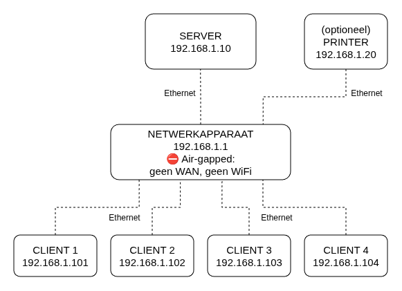
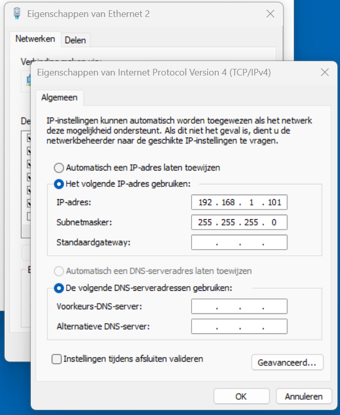

# Netwerk inrichten

Voordat je Abacus installeert is het belangrijk dat het netwerk goed is ingericht. De regels hiervoor staan in de aansluit- en gebruiksvoorwaarden, die je vindt in de toolkit van de verkiezing op de website van de Kiesraad. Dit netwerk kun je op dezelfde manier opzetten als bij OSV2020.

Je installeert Abacus op één computer die dient als server. De andere computers zijn clients en maken via de browser verbinding met de Abacus-server. Abacus mag alleen gebruikt worden in een netwerk dat niet verbonden is met het internet. Dit noemen we ook wel een *airgapped* netwerk.

## Benodigdheden

- Een hub of netwerkapparaat
- Een server en een aantal clients
- Voldoende ethernetkabels voor alle apparaten
- Extra (unmanaged) netwerkswitches om meer apparaten te kunnen aansluiten (optioneel)

## Opzet van het netwerk

Zo stel je het netwerk in:

- Gebruik een hub of netwerkapparaat met voldoende poorten. Als je meer clients gebruikt dan er poorten zijn, dan kun je één of meer (unmanaged) switches aansluiten tussen het netwerkapparaat en de clients.
- Sluit de server met een ethernetkabel aan op het netwerkapparaat, en doe hetzelfde met de clients en optioneel met de printer.



## Statische IP-adressen

Geef alle computers een vast (statisch) IP-adres, zodat je ze altijd kunt identificeren. In het voorbeeld worden IP-adressen in de reeks `192.168.1.0/24` gebruikt.

### Op Windows

- Klik op **Win+R** en zoek op `ncpa.cpl` om de klassieke weergave voor netwerkverbindingen te openen.
- Klik met de rechtermuisknop op de ethernetverbinding en klik op **Eigenschappen**.
- Selecteer de regel **Network Protocol Version 4 (TCP/IPv4)** en klik op **Eigenschappen**.
- Selecteer **Het volgende IP-adres gebruiken:** en voer het IP-adres in. Als je op het subnetmasker klikt wordt automatisch `255.255.255.0` ingevuld, dit kun je zo laten. Klik op **OK** en vervolgens op **Sluiten**.



### Op Linux

Op Linux zijn er verschillende manieren om een statisch IP toe te wijzen. Verander het IP-adres op een snelle manier met de volgende opdracht:

```
sudo ip addr add 192.168.1.101/24 dev eth0
```

Als je wilt dat het statische IP-adres ingesteld blijft wanneer je opnieuw opstart, voeg je de netwerkgegevens toe aan het configuratiebestand voor jouw Linux-distributie.

## Airgapped netwerk

Nu zorg je dat het netwerk airgapped is en er geen internetverbindingen mogelijk zijn:

- Installeer op elke computer de meest recente updates van het besturingssysteem voordat je de verbinding met het internet verbreekt.
- Zorg dat alle aanwezige draadloze communicatiemodules zoals wifi en Bluetooth zijn gedeactiveerd, ook op de printer.
- Op de computers zelf zet je de wifi-functie uit zodat er ook op die manier geen internetverbinding kan worden gemaakt.
- Zorg dat de datum en tijd van alle computers kloppen. Als de datum en tijd afwijken, kan dit onder andere leiden tot problemen met inloggen.

## Testen

Zorg dat Abacus op de server draait en het beveiligingscertificaat is geïnstalleerd. Open vervolgens de browser op je client en ga naar het IP-adres van de Abacus-server om te testen of de browser verbinding maakt. Maak ook een bladwijzer in de browser zodat je Abacus snel weer kunt openen. Dit doe je voor alle client-computers.

## Meer informatie

Meer informatie over de vereisten voor de computer en het besturingssysteem vind je in het hoofdstuk [Systeemvereisten](../systeemvereisten.md).
