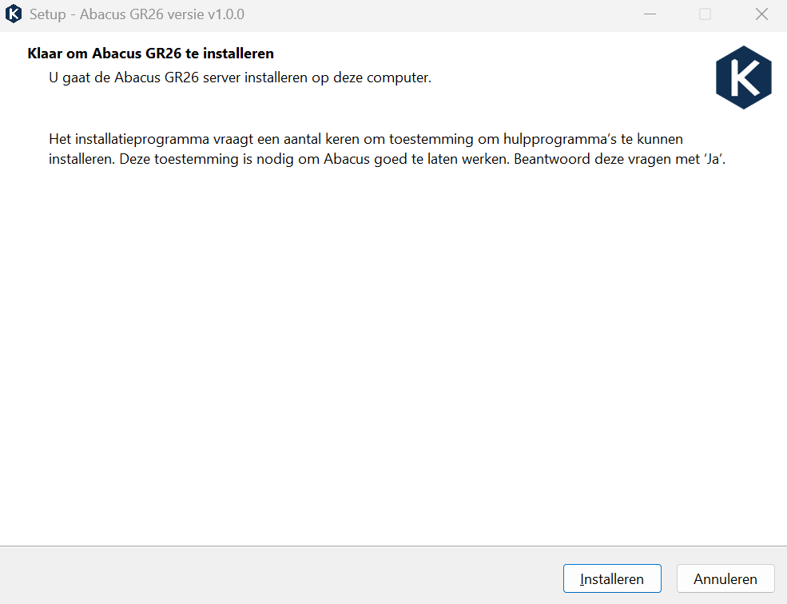
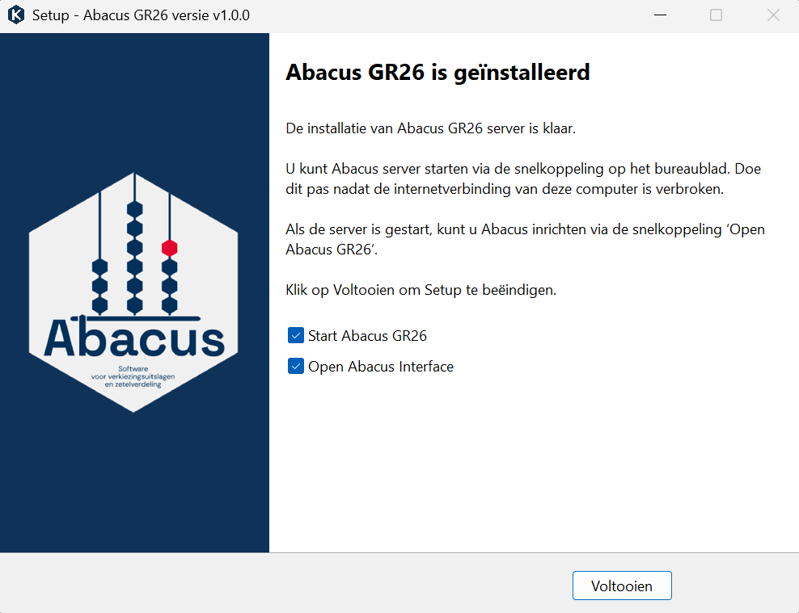

# Windows

Met deze methode installeer je Abacus op een Windows-machine.
Deze versie is geschikt om mee te testen. Het is nog niet de definitieve versie van Abacus. Die ontvangen de gemeenten rechtstreeks van de Kiesraad.

## Downloaden en installeren

- Je downloadt Abacus via Rijkscloud SecureFileTransfer. Deze link krijg je van de Kiesraad.
- Dubbelklik op het gedownloade bestand om het installatieprogramma te openen. Selecteer **Installeren**.

- Tijdens het installatieprogramma wordt Microsoft Visual C++ Redistributable geïnstalleerd en wordt een firewallregel ingesteld via Windows Command Prompt. Daarom zie je tijdens de installatie twee keer een pop-up waarin wordt gevraagd *Wilt u toestaan dat deze app wijzigingen aan uw apparaat aanbrengt?*. Selecteer in beide gevallen **Ja**.

- Bij de melding *Het toevoegen van de firewallregel is succesvol uitgevoerd* selecteer je **OK**.
- Abacus is nu geïnstalleerd. Als je Abacus niet direct wil starten en de interface niet wil openen in de browser, zet dan de vinkjes uit. Selecteer **Voltooien** om het installatieprogramma te sluiten.

## Starten

Bij deze installatiemethode worden drie snelkoppelingen op het bureaublad geplaatst:

- Met **1. Start Abacus GR26 server** start je de Abacus-server. Gebruik deze snelkoppeling voordat je Abacus opent in de browser.
- Met **2. Open Abacus GR26 in browser** open je de browserinterface.
- Met **Abacus GR26 database map** open je de map met de databasebestanden.

**Let op:** Wanneer je de Abacus-server start, start Windows een command prompt. Zorg ervoor dat dit venster open blijft. Als je dit venster sluit wordt de Abacus-server gestopt.
