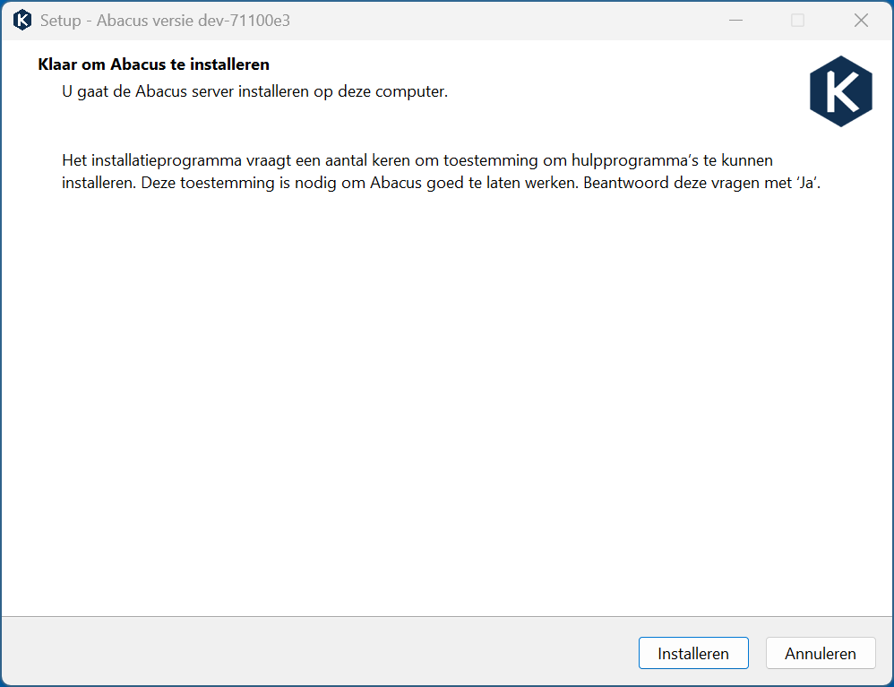
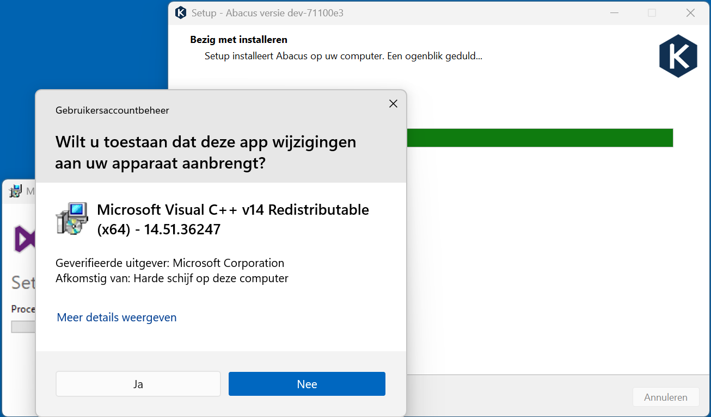
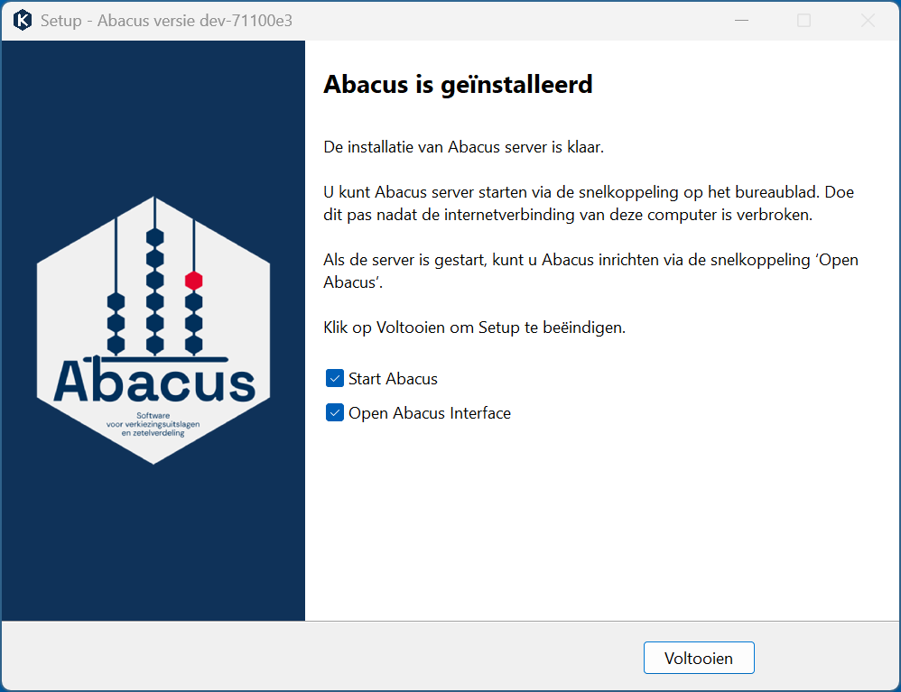
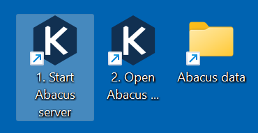

# Installeren op Windows

Met deze methode installeer je Abacus op een Windows-computer.

**Let op:** Het beveiligingscertificaat wordt geïnstalleerd op Windows, en het bestand wordt in de map `tls` geplaatst in de installatiemap. Dit certificaat kun je daarna op alle computers installeren volgens de instructies in het hoofdstuk [Beveiligingscertificaat](./certificaat.md).

## Downloaden en installeren

- Je downloadt Abacus via Rijkscloud SecureFileTransfer. Deze link krijg je van de Kiesraad.
- Dubbelklik op het gedownloade bestand om het installatieprogramma te openen. Selecteer **Installeren**.

- Tijdens het installatieprogramma wordt Microsoft Visual C++ Redistributable geïnstalleerd. Ook worden de firewall en het beveiligingscertificaat ingesteld via Windows Command Prompt. Daarom zie je tijdens de installatie twee keer een pop-up waarin wordt gevraagd *Wilt u toestaan dat deze app wijzigingen aan uw apparaat aanbrengt?*. Selecteer in beide gevallen **Ja**.

- Bij de melding *Het instellen van de firewall en het beveiligingscertificaat is succesvol uitgevoerd* selecteer je **OK**.
- Abacus is nu geïnstalleerd. Als je Abacus niet direct wil starten en de interface niet wil openen in de browser, zet dan de vinkjes uit. Selecteer **Voltooien** om het installatieprogramma te sluiten.

## Starten

Bij deze installatiemethode worden drie snelkoppelingen op het bureaublad geplaatst:

- Met **1. Start Abacus server** start je de Abacus-server. Gebruik deze snelkoppeling altijd voordat je Abacus opent in de browser.
- Met **2. Open Abacus in browser** open je de browserinterface.
- Met **Abacus data** open je de map met alle data, zoals de databasebestanden en back-ups.

**Let op:** Wanneer je de Abacus-server start, start Windows een zwart opdrachtvenster (command prompt). Je kunt dit venster minimaliseren, maar zorg ervoor dat het open blijft. Als je dit venster sluit wordt de Abacus-server gestopt.
