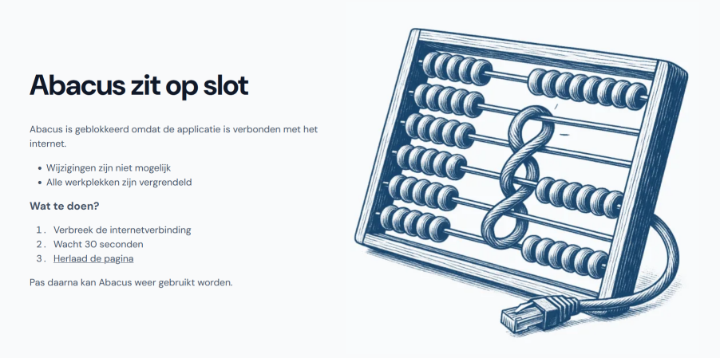

# Problemen oplossen

## Bekende problemen

Bekende problemen (of *known issues*) in versie 1.1 worden hier gedocumenteerd. We zijn op de hoogte van deze problemen en ze worden opgelost in een latere fase.

| Probleem | Oplossing |
|----------|-----------|
| Het EXE-bestand en de databasebestanden blijven bestaan als Abacus wordt verwijderd zonder eerst af te sluiten. | Sluit eerst Abacus af voordat je Abacus gaat verwijderen. |
| In een tweede of latere zitting is het niet mogelijk om een stembureau te verwijderen als die aan een onderzoek is gekoppeld. | Verwijder eerst het onderzoek en daarna pas het stembureau. |

## Problemen en oplossingen

Hier lees je voor elke rol welke problemen er kunnen ontstaan en wat de oplossingen zijn.

### Installatie

**Het EXE-bestand en de databasebestanden blijven bestaan als Abacus wordt verwijderd zonder eerst af te sluiten.**

Sluit eerst Abacus af voordat je Abacus gaat verwijderen.

**Abacus is geblokkeerd omdat de applicatie is verbonden met het internet.**

Controleer de netwerkverbindingen in het hele netwerk en schakel alles uit. Let ook op dat alle Bluetooth-verbindingen uit staan en de printer (indien aanwezig) geen verbinding heeft met het internet. Wanneer de internetverbinding verbroken is, wacht je 30 seconden en herlaad je de pagina door op de link <ins>Herlaad de pagina</ins> te klikken.

### Beheerder

**Abacus is geblokkeerd omdat de applicatie is verbonden met het internet.**

Controleer de netwerkverbindingen in het hele netwerk en schakel alles uit. Let ook op dat alle Bluetooth-verbindingen uit staan en de printer (indien aanwezig) geen verbinding heeft met het internet. Wanneer de internetverbinding verbroken is, wacht je 30 seconden en herlaad je de pagina door op de link <ins>Herlaad de pagina</ins> te klikken.

### Coördinator GSB

**Abacus is geblokkeerd omdat de applicatie is verbonden met het internet.**

Geef dit door aan de beheerder. Die controleert de netwerkverbindingen en schakelt alles uit. Wanneer de internetverbinding verbroken is, wacht je 30 seconden en herlaad je de pagina door op de link <ins>Herlaad de pagina</ins> te klikken.

**In een tweede of latere zitting is het niet mogelijk om een stembureau te verwijderen als die aan een onderzoek is gekoppeld.**

Verwijder eerst het onderzoek en daarna pas het stembureau.

### Coördinator CSB

**Abacus is geblokkeerd omdat de applicatie is verbonden met het internet.**

Geef dit door aan de beheerder. Die controleert de netwerkverbindingen en schakelt alles uit. Wanneer de internetverbinding verbroken is, wacht je 30 seconden en herlaad je de pagina door op de link <ins>Herlaad de pagina</ins> te klikken.

### Invoerder

**Abacus is geblokkeerd omdat de applicatie is verbonden met het internet.**

Geef dit door aan de coördinator. Die overlegt met de beheerder om dit probleem op te lossen. Wanneer de internetverbinding verbroken is, wacht je 30 seconden en herlaad je de pagina door op de link <ins>Herlaad de pagina</ins> te klikken.

**Ik kan geen getallen invoeren met het toetsenblok aan de rechterkant van het toetsenbord.**

Druk op de **Num**- of **Num Lock**-toets op het toetsenblok. Je kunt het toetsenblok dan weer gebruiken.
