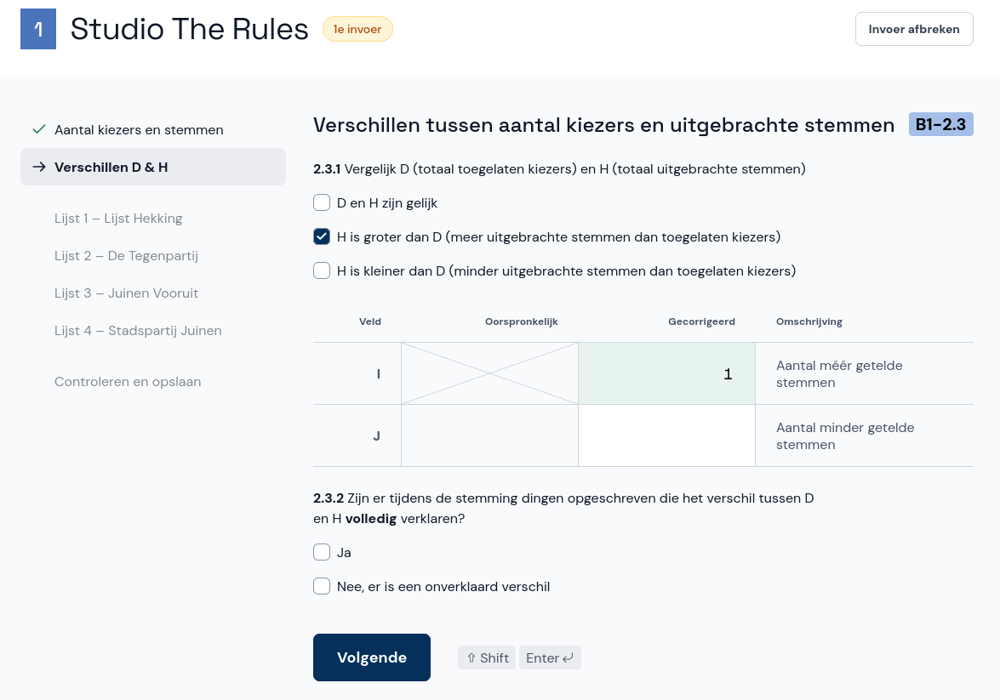

# Extra zitting: corrigendum invoeren (alleen GSB)

Nadat de gemeentelijke uitslag bekend is gemaakt, controleert het centraal stembureau deze uitslag. Als het centraal stembureau hier aanleiding toe ziet, geeft het opdracht tot onderzoek. Een stembureau wordt dan mogelijk (deels) herteld. Als er gewijzigde resultaten zijn, leidt dit tot een corrigendum waar de nieuwe, juiste aantallen in staan.

- Ook een corrigendum wordt twee keer ingevoerd. Het invoeren van een corrigendum werkt hetzelfde als het invoeren van een stembureau in de eerste zitting.
- Er is maar één verschil: Neem alleen de getallen die veranderd zijn over uit het corrigendum.
  - Als het vakje leeg is in het corrigendum, laat het dan ook leeg in Abacus.
  - Zodra je een veranderd getal hebt ingevuld, zet Abacus automatisch een kruis door het oude getal.

Wanneer je klaar bent, sla je de invoer op dezelfde manier op als in de eerste zitting. Ook hier wordt de invoer twee keer gedaan door twee verschillende invoerders.
