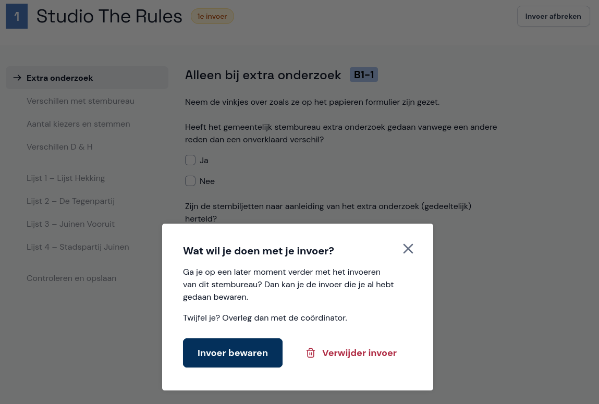

# Pauzeren of afbreken

Als je pauze neemt, klik je rechtsboven op **Invoer afbreken** en bewaar je de invoer. Na je pauze zie je het stembureau staan onder **Je hebt nog een openstaande invoer** en kun je doorgaan waar je gebleven was. Je kunt de invoer ook verwijderen, bijvoorbeeld omdat je opnieuw wil beginnen.

