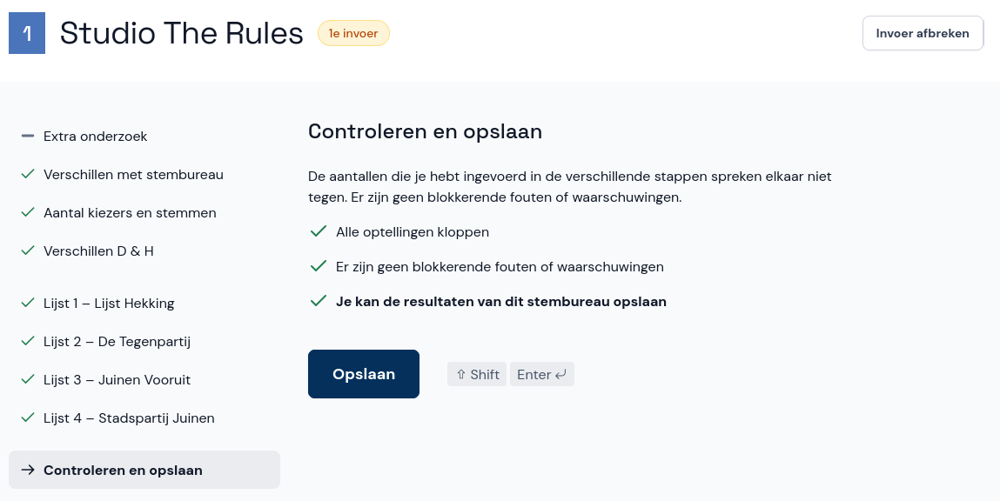

# Afronden

Heb je de laatste lijst ingevoerd en zijn er geen fouten of waarschuwingen, of heb je eventuele fouten en waarschuwingen besproken met je coördinator? Dan kan je de resultaten van het stembureau opslaan.

Je invoer is nu opgeslagen en je hoeft niets meer te doen. De coördinator verwerkt eventuele fouten en waarschuwingen. Als je nog een stembureau wil invoeren, kun je direct een ander stembureaunummer invullen of een stembureau uit de lijst kiezen.
