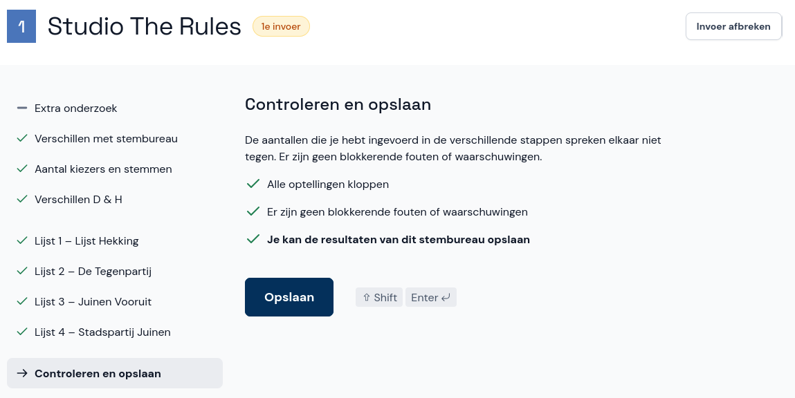

# Controleren en opslaan

Wanneer je de laatste lijst hebt ingevoerd, selecteer je **Volgende**. Het kan zijn dat je bij het opslaan een waarschuwing krijgt. Er wordt je dan gevraagd om te controleren op fouten. Bij waarschuwingen en fouten doe je het volgende:

- Controleer of je het papieren proces-verbaal goed hebt overgenomen en herstel eventueel je invoer. Met de link boven de waarschuwing of fout ga je naar de plek waar deze voorkomt, en Abacus laat duidelijk zien welke velden je extra moet controleren. **Let op:** je mag het papieren proces-verbaal nooit aanpassen, ook niet als je fouten ziet. Neem de invoer precies over zoals het op het papier staat.
- Klopt je invoer, maar is de fout of waarschuwing nog zichtbaar? Bespreek de fouten dan met je coördinator. Als de coördinator ook vindt dat alles klopt, vink je de optie **Ik heb de fouten besproken met de coördinator** aan en klik je op **Afronden**.

Als er geen waarschuwingen zijn of als je alle waarschuwingen hebt gecontroleerd of besproken, selecteer je **Opslaan**.

Als je een invoer voor het gemeentelijk stembureau doet en nog een stembureau wil invoeren, kun je direct een ander stembureaunummer invullen of een stembureau uit de lijst kiezen.
