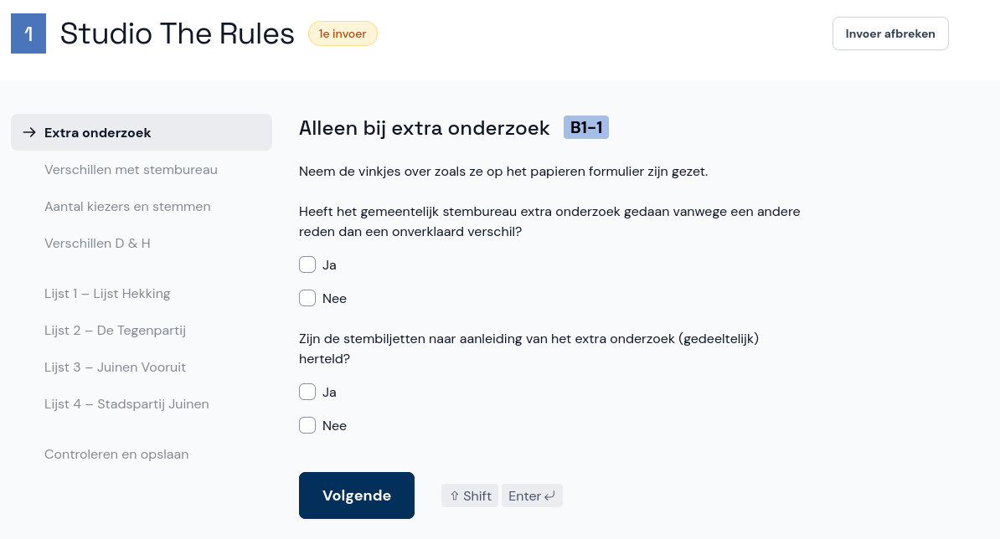

# Extra onderzoek (alleen GSB)

*Dit scherm zie je alleen wanneer je een proces-verbaal invoert voor het gemeentelijk stembureau.*

Op pagina 1 van het papieren proces-verbaal is aangegeven of er extra onderzoek is uitgevoerd.

Neem de vinkjes over zoals ze in het proces-verbaal staan en selecteer **Volgende**.

Als de vragen op het papier niet zijn ingevuld, dan is er geen extra onderzoek uitgevoerd en kun je direct doorgaan naar de volgende pagina.
