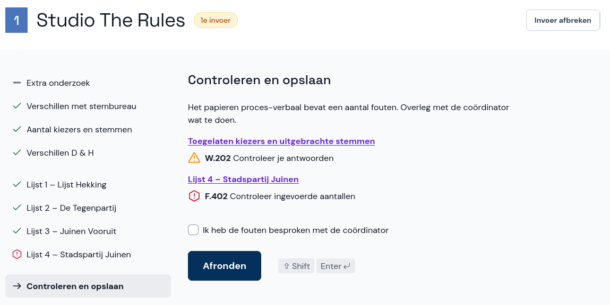

# Fouten en waarschuwingen

Het kan zijn dat je tijdens het invoeren of bij het opslaan een waarschuwing krijgt. Er wordt je dan gevraagd om te controleren op fouten. Hieronder lees je wat je moet doen wanneer je fouten of waarschuwingen ziet. In het algemeen geldt: als je niet zeker weet wat je moet doen, overleg dan met je coördinator. Meer informatie over de fouten en waarschuwingen vind je in de [spiekbrief](../../spiekbrief/foutcodes/).

## Tijdens de invoer

Controleer of je het papieren proces-verbaal goed hebt overgenomen en herstel eventueel je invoer. Abacus laat duidelijk zien welke velden je extra moet controleren.

Zie je een fout of waarschuwing, maar heb je de invoer gecontroleerd en correct overgenomen? Vink dan de optie aan en ga door naar de volgende pagina.

Bij een **tweede invoer** zie je mogelijk extra waarschuwingen als jouw invoer verschilt met de eerste invoer. Hier ga je op dezelfde manier mee om.

## Bij het afronden van de invoer

Zie je fouten en waarschuwingen die niet geaccepteerd zijn, maar heb je de invoer gecontroleerd en correct overgenomen? Bespreek de fouten dan met je coördinator. Vink daarna de optie aan en rond de invoer af.

