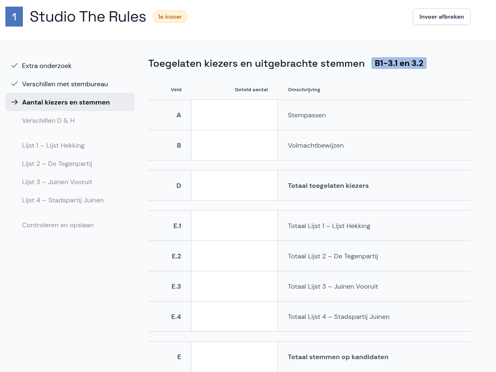

# Aantal kiezers en stemmen

Nu voer je de toegelaten kiezers en uitgebrachte stemmen in.

- Voor het **gemeentelijk stembureau** zijn dit de velden A tot en met H in rubriek B1 - 3.1 en 3.2 van het papieren proces-verbaal.

- Voor het **centraal stembureau** zijn dit de velden Z en A tot en met H in rubriek 2.1 tot en met 2.3 van het proces-verbaal van het gemeentelijk stembureau.

Neem de cijfers over zoals ze in het proces-verbaal staan en selecteer **Volgende**.
