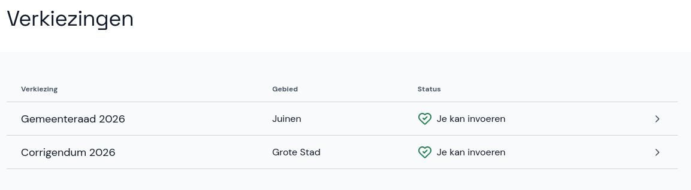
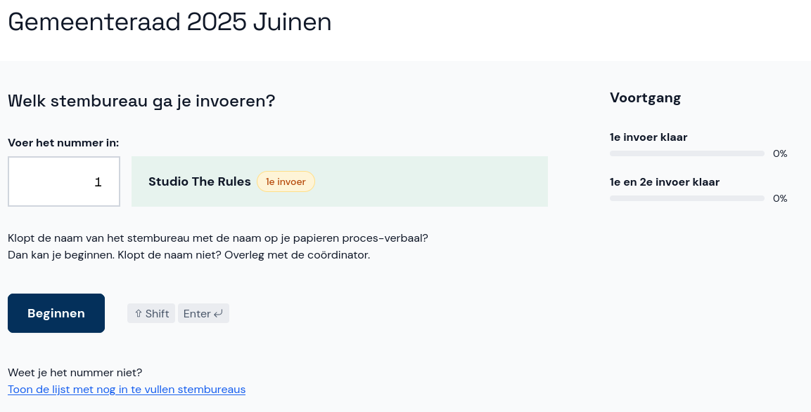
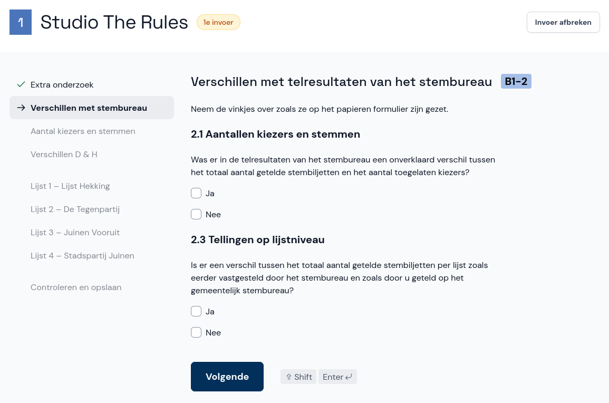
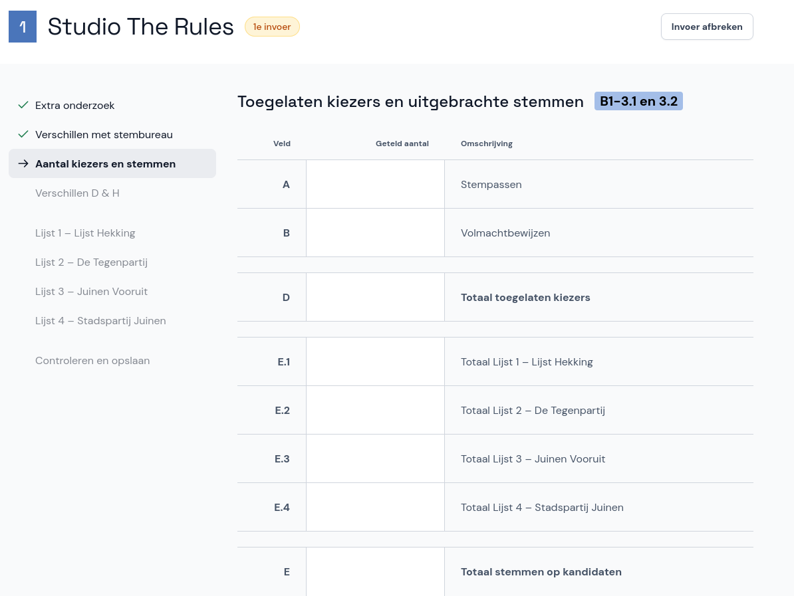

# Selecteren en invoeren

## Verkiezing en stembureau selecteren

Selecteer eerst de verkiezing waarvoor je stemmen wil invoeren. Hier zie je ook wat de status van de verkiezing is.

Kies het stembureau door het stembureaunummer in te voeren. Dit nummer staat op het proces-verbaal. Weet je het nummer niet? Je kunt het juiste stembureau ook opzoeken in de lijst met nog in te vullen stembureaus, die je onderaan de pagina vindt. Bij een invoer voor het centraal stembureau kun je direct op het stembureau klikken.

## Proces-verbaal overnemen

Nu kun je beginnen met invoeren. Op elke pagina neem je de vinkjes en getallen over zoals ze op het papieren formulier staan, en wanneer je klaar bent ga je door naar de volgende pagina. Ga hiermee door tot je het hele proces-verbaal hebt overgenomen in Abacus.

> <i class="fa-solid fa-circle-exclamation"></i> **Let op**  
> Je mag het papieren proces-verbaal nooit aanpassen, ook niet als je fouten ziet. Neem de invoer precies over zoals het op het papier staat.

*Dit is een voorbeeld van een pagina met vinkvragen.*

*Dit is een voorbeeld van een pagina met velden waar je getallen invult.*
