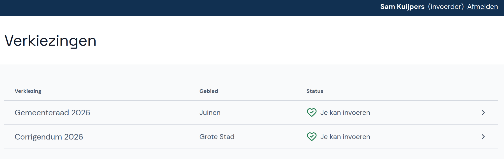
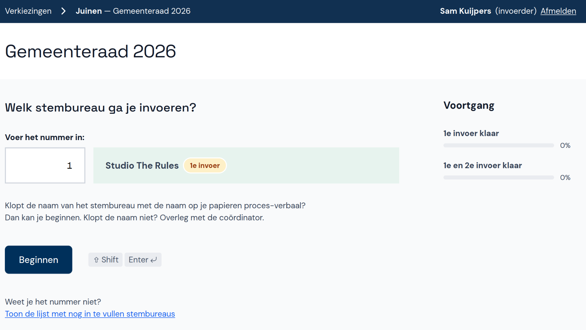

# Verkiezing en stembureau selecteren

Selecteer eerst de verkiezing waarvoor je stemmen wil invoeren. Hier zie je ook wat de status van de verkiezing is.

Selecteer nu het stembureau:

- Voer het nummer in van het stembureau dat je wil invoeren. Het nummer vind je op het proces-verbaal.
- Weet je het nummer niet, selecteer dan onderaan de pagina **Toon de lijst met nog in te vullen stembureaus** en selecteer vervolgens het juiste stembureau.
- Bij het centraal stembureau kun je direct het stembureau selecteren.

