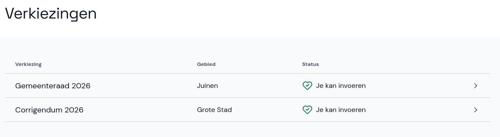
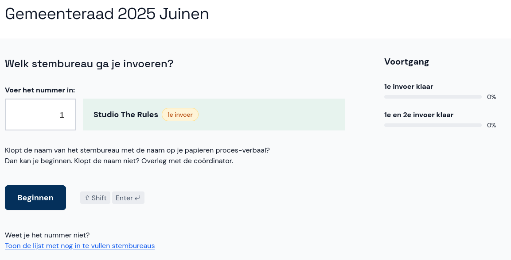
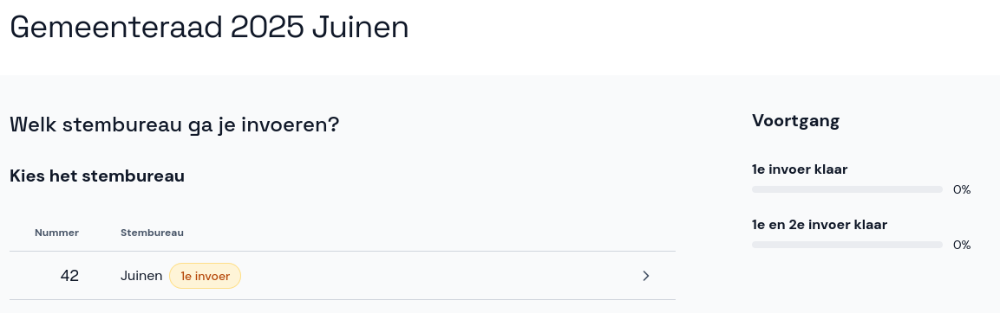

# Verkiezing en stembureau selecteren

Selecteer eerst de verkiezing waarvoor je stemmen wil invoeren. Hier zie je ook wat de status van de verkiezing is.

Selecteer nu het stembureau:

- Bij een invoer voor het *gemeentelijk stembureau* voer je het nummer in van het stembureau dat je wil invoeren en klik je op **Beginnen**. Het nummer vind je op het proces-verbaal.
- Weet je het nummer niet, selecteer dan onderaan de pagina **Toon de lijst met nog in te vullen stembureaus** en selecteer vervolgens het juiste stembureau.

- Bij een invoer voor het *centraal stembureau* kun je het stembureau direct selecteren.
- Je begint dan met de stap [Aantal kiezers en stemmen](./kiezers-stemmen.md). **Let op**: aan de linkerkant van het scherm zie je alleen de stappen die relevant zijn voor het centraal stembureau.

