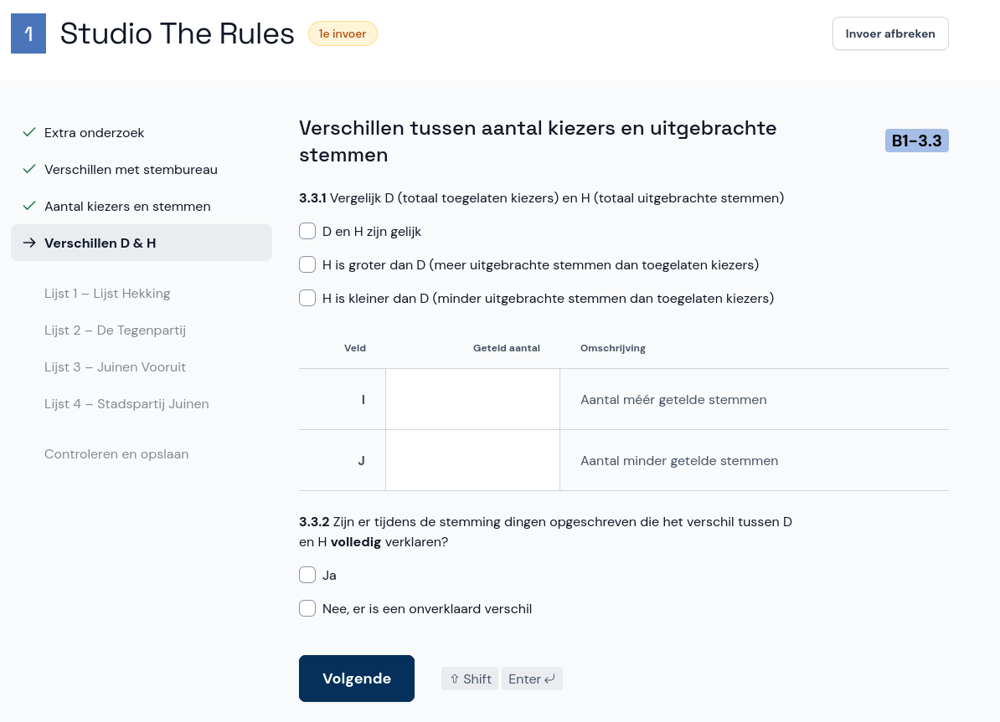

# Verschillen D & H

Op het papieren proces-verbaal is aangegeven of er verschillen zijn tussen het aantal kiezers en het aantal uitgebrachte stemmen.

- Bij een invoer voor het *gemeentelijk stembureau* neem je de vinkjes en cijfers over zoals ze in het proces-verbaal staan.

- Bij een invoer voor het *centraal stembureau* neem je alleen de cijfers over. De vinkvraag in het proces-verbaal hoef je niet in te vullen.

- Wanneer je klaar bent selecteer je **Volgende**.
