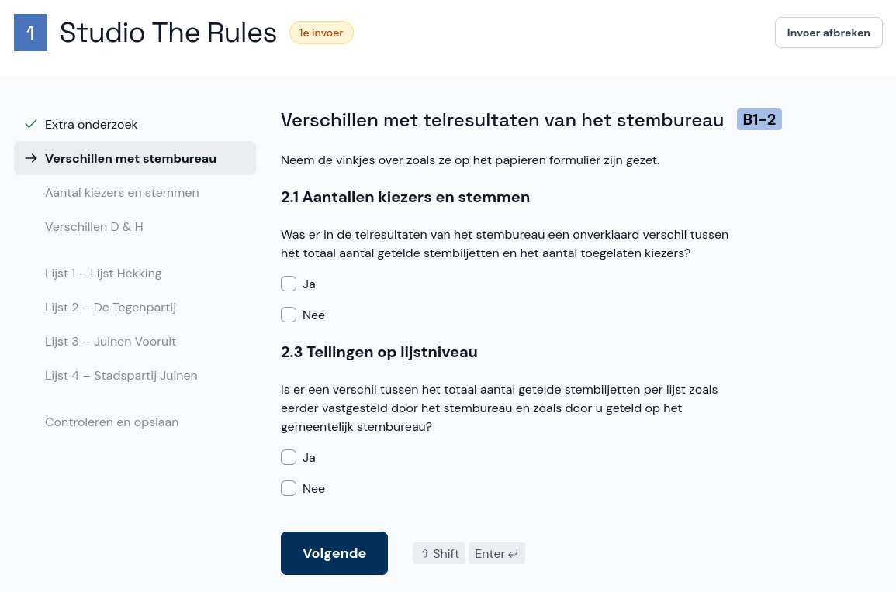

# Verschillen met stembureau (alleen GSB)

*Dit scherm zie je alleen wanneer je een proces-verbaal invoert voor het gemeentelijk stembureau.*

Op pagina 2 van het papieren proces-verbaal is aangegeven of er verschillen zijn met de telresultaten van het stembureau.

Neem de vinkjes over zoals ze in het proces-verbaal staan en selecteer **Volgende**.

