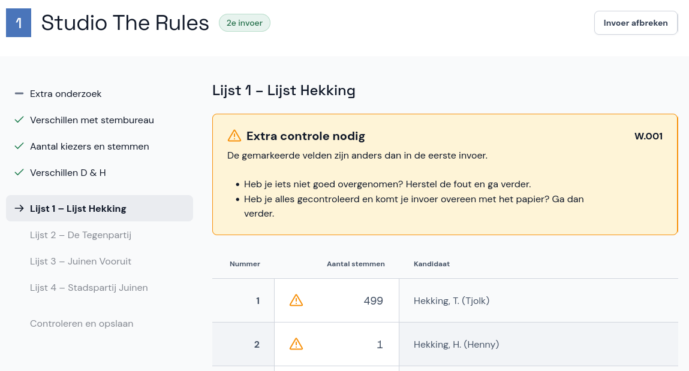
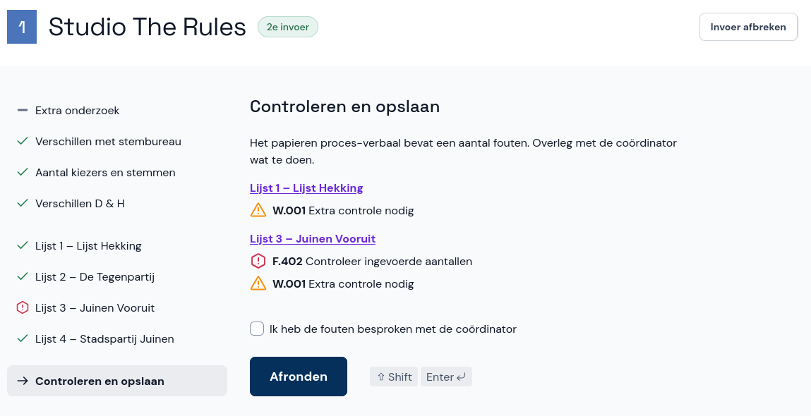

# Tweede invoer

Nadat de eerste invoer klaar is, doet een andere invoerder een tweede invoer. Dit gaat op dezelfde manier als de eerste invoer. Bij een tweede invoer zie je mogelijk extra waarschuwingen als jouw invoer verschilt met de eerste invoer. Deze los je ook op volgens de instructies hierboven.

Zie je bij het afronden van de invoer fouten en waarschuwingen die niet geaccepteerd zijn, maar heb je de invoer gecontroleerd en correct overgenomen? Bespreek de fouten dan met je coördinator. Vink daarna de optie aan en rond de invoer af.

