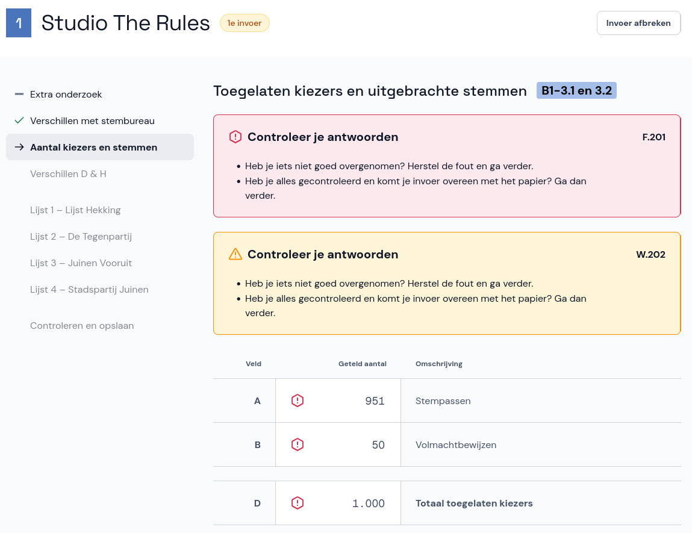
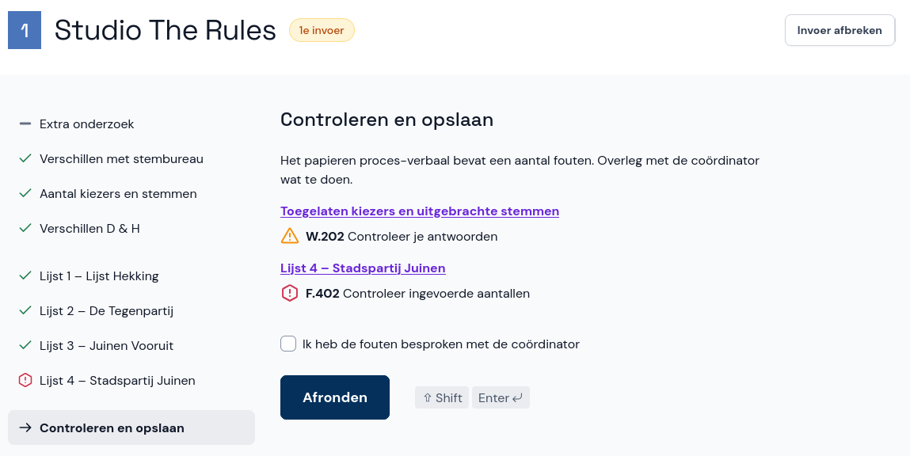

# Fouten en waarschuwingen

Het kan zijn dat je een fout of waarschuwing krijgt tijdens de invoer of bij de stap *Controleren en opslaan*. Er wordt je dan gevraagd om te controleren op fouten. Bij waarschuwingen en fouten doe je het volgende:

## Tijdens de invoer

- Controleer of je het papieren proces-verbaal goed hebt overgenomen en herstel eventueel je invoer. Abacus laat duidelijk zien welke velden je extra moet controleren. **Let op:** je mag het papieren proces-verbaal nooit aanpassen, ook niet als je fouten ziet. Neem de invoer precies over zoals het op het papier staat.
- Als alles klopt, vink je de optie **Ik heb mijn invoer gecontroleerd met het papier en correct overgenomen** aan en kun je doorgaan naar de volgende pagina.
- In het algemeen geldt: als je niet zeker weet wat je moet doen, overleg dan met je coördinator.

## Bij Controleren en opslaan

- Controleer of je het papieren proces-verbaal goed hebt overgenomen en herstel eventueel je invoer. Met de link boven de waarschuwing of fout ga je naar de plek waar deze voorkomt, en Abacus laat duidelijk zien welke velden je extra moet controleren. **Let op:** je mag het papieren proces-verbaal nooit aanpassen, ook niet als je fouten ziet. Neem de invoer precies over zoals het op het papier staat.
- Klopt je invoer, maar is de fout of waarschuwing nog zichtbaar? Bespreek de fouten dan met je coördinator. Als de coördinator ook vindt dat alles klopt, vink je de optie **Ik heb de fouten besproken met de coördinator** aan en klik je op **Afronden**.

