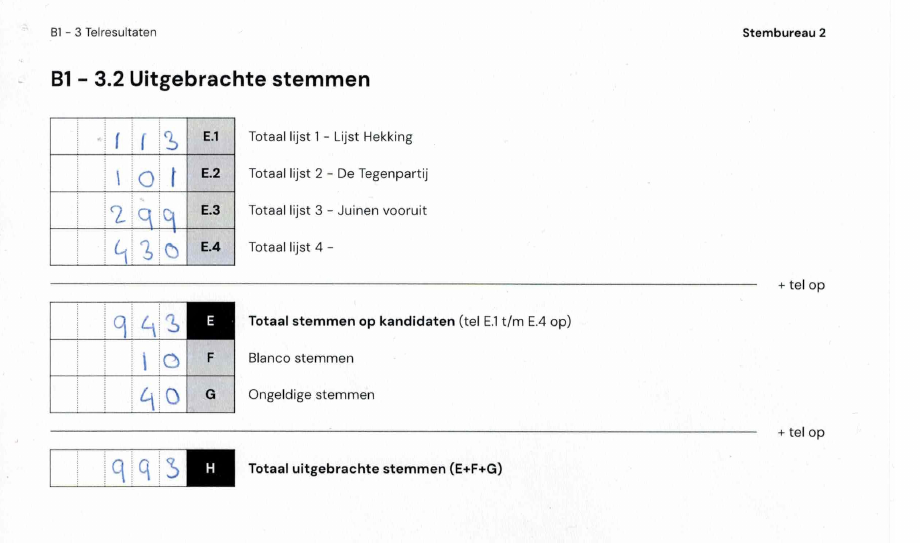

# Het verkiezingsproces

In Nederland stemmen we op papier. In het stembureau gelden strikte regels om het stemgeheim te bewaren.

*Beeld: ©Kiesraad, Martijn Beekman*

Na het sluiten van de stembussen worden alle stemmen met de hand geteld, waarbij een vier-ogenprincipe wordt gehanteerd. De stemmen worden op lijst gesorteerd waarna de stemmen per kandidaat worden geteld.

*Beeld: ©Kiesraad, Martijn Beekman*

Wanneer alle stemmen geteld zijn, vult de voorzitter van het stembureau alle uitkomsten in op een proces-verbaal. Het totale aantal toegelaten kiezers (met stempas, volmacht en kiezerspas), het aantal uitgebrachte stemmen en het eventuele verschil daartussen worden eerst ingevuld. Vervolgens worden alle stemmen per kandidaat ingevuld[^1]. Dat ziet er zo uit:

Dan wordt alles naar een centrale plek in de gemeente gebracht (meestal het gemeentehuis), waar het gemeentelijk stembureau de werkzaamheden overneemt.

[^1]: Het proces waarbij alle stemmen per kandidaat direct in het stembureau worden geteld heet *decentrale stemopneming*. In sommige gemeentes tellen de stembureaus alleen de stemmen per lijst, waarna de stemmen per kandidaat op bij het gemeentelijk stembureau worden geteld. Dit heet *centrale stemopneming*.
