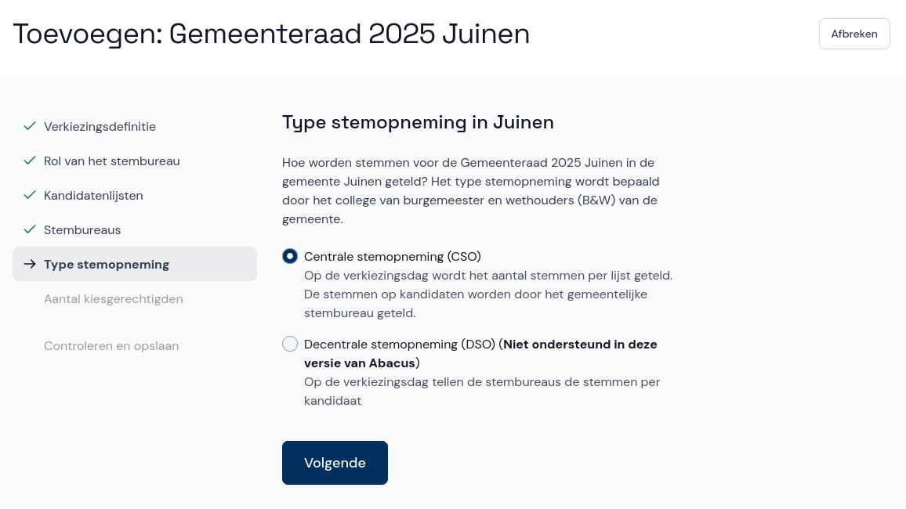

# Type stemopneming

Nu zie je opties voor het type stemopneming. Centrale stemopneming (CSO) is op dit moment de enige optie, decentrale stemopneming (DSO) wordt in een volgende versie toegevoegd. Klik daarom meteen op **Volgende**.

